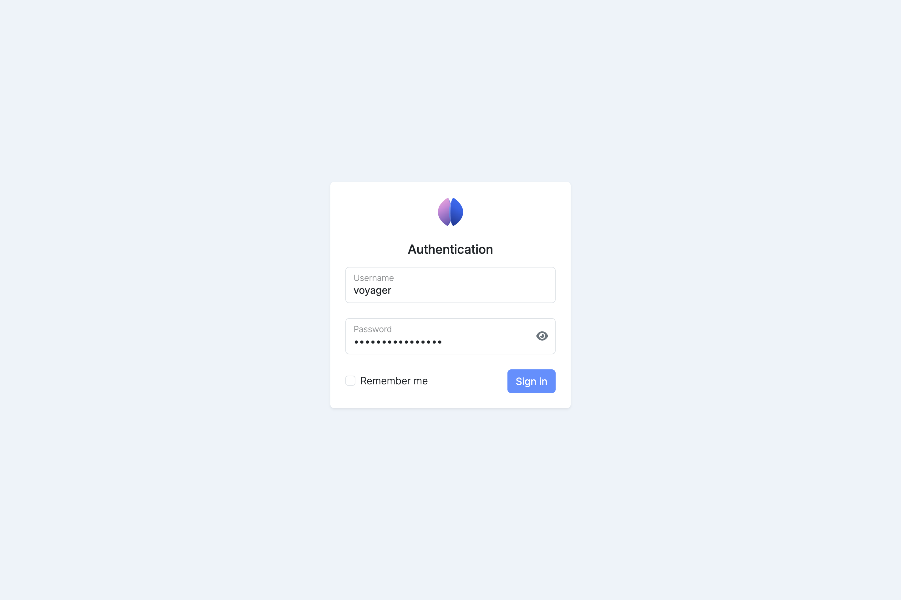
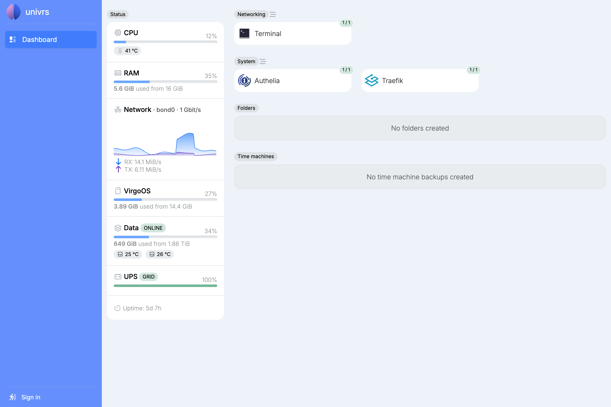
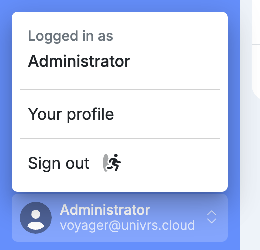

## Signing in

Open the node at its name, for example `https://spica.virgo.univrs.cloud`, and sign in with your username and password.

Signing in only works through the node's name, not through its IP address.

Select **Remember me** to stay signed in on this browser for 7 days.

## On your local network and over the VPN

On your local network (addresses starting with `192.168`) and when connected through the node's VPN, nothing is gated by a node account.

The dashboard opens without signing in, so anyone there can quickly find the shortcuts to the apps they want to open. To change anything on the node, select **Sign in**.

Apps open without the node's sign-in too, but each app still asks you to sign in with its own account.

## Apps and the node's sign-in

From outside your network, not all apps are gated. Some are gated by a node account: you sign in to the node first, then to the app itself. The others only ask for their own sign-in.

## Failed attempts

After 3 failed sign-in attempts within 10 minutes, signing in from that address is blocked for 12 hours.

## Signing out

Open the account menu with your name, then select **Sign out**.

## Through your fleet

When the node is registered with a fleet, you can also manage it from [fleet.univrs.cloud](https://fleet.univrs.cloud). There you sign in with your fleet account, not with a user of the node.
