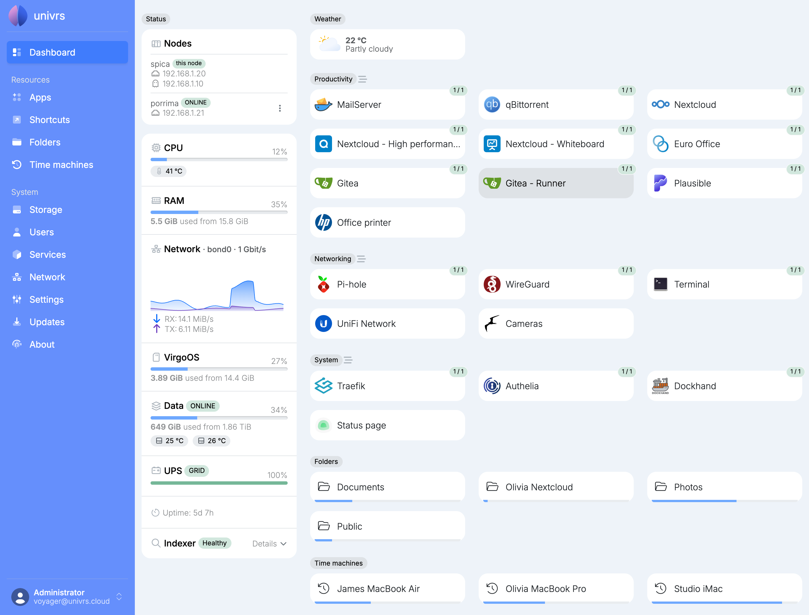
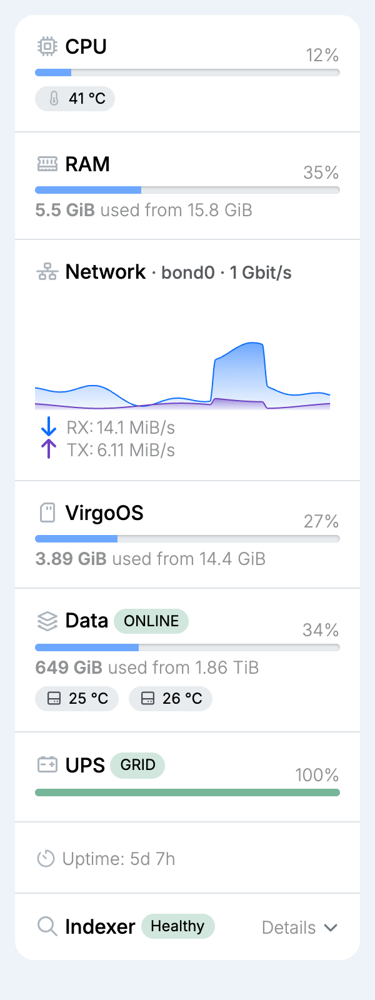
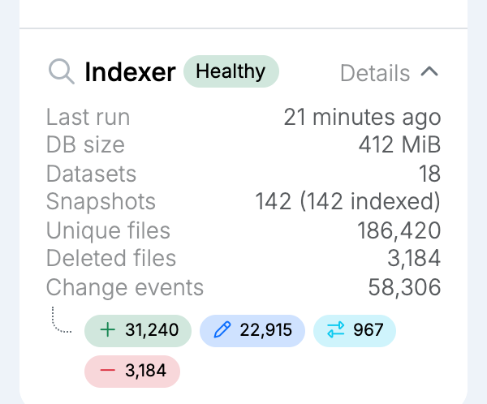
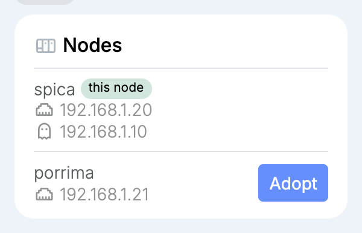
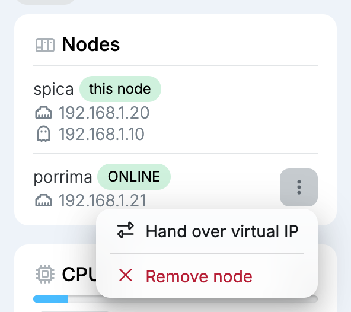
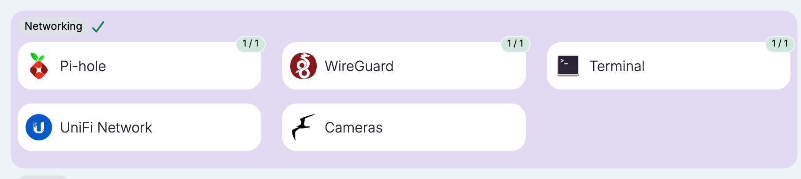
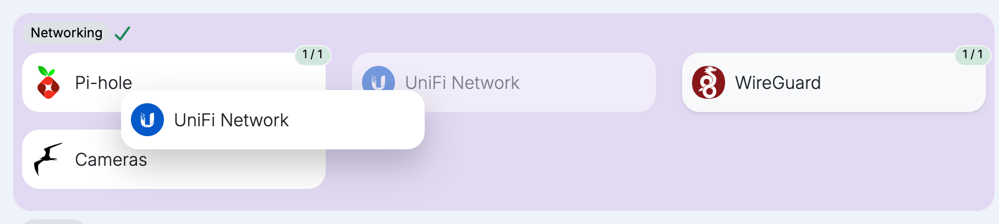

The **Dashboard** is the first page after signing in. It shows how the node is doing, and brings its apps, shortcuts, folders and time machines together in one place. This page describes it as administrators see it.

## Status

The **Status** column shows the node's resources as they change:

- **CPU:** the processor's load and temperature, and the fan speed when the node has a fan.
- **RAM:** how much memory is in use.
- **Network:** the traffic on the node's network connection over the last minute, received (**RX**) and sent (**TX**), with the connection's name and speed.
- **VirgoOS:** how full the system drive is.
- **Data:** the [storage pool](/management/system/storage/)'s health and how full it is, with the temperature of each drive. A drive's badge turns yellow or red when it gets too warm, and orange when its own health check reports a problem; hover over it to see what it reports. While a data integrity check runs, its progress shows here too.
- **UPS:** whether the node runs on the grid or on battery, and how charged the battery is.
- **Uptime:** how long the node has been running since it last started.
- **Indexer:** the catalogue of the files in the pool's snapshots, searched from an app's [snapshots](/management/resources/apps/snapshots/#searching-files) and by the [`virgo indexer`](/cli/indexer/) commands to find earlier and deleted versions of a file.

### Indexer

The indexer runs every hour, at ten past. Its badge says how it is doing:

- **Healthy:** every snapshot is catalogued.
- **Catching up...:** some snapshots are still waiting to be catalogued.
- **Recovered:** the last run had to start over, but finished.
- **Degraded:** a snapshot could not be catalogued.

Select **Details** to see the last run, the catalogue's size, how many datasets and snapshots it covers, how many unique and deleted files it knows, and how many changes it has recorded, split into added, modified, renamed and removed. Select it again to hide them.

To add an app's snapshots to the catalogue, turn on **Indexer** in its [snapshots](/management/resources/apps/snapshots/#searching-files).

## Nodes

When there are other nodes on your network, the **Nodes** card lists them together with this one, marked **this node**. Each node shows its address, and the node holding the [virtual IP](/management/system/network/#interface) shows that address too.

### Adopting a node

A node found on your network that is not part of the cluster has an **Adopt** button.

Adopting it joins it to this node's cluster, where it shares the virtual IP. Each node in the cluster is then reachable at its own name, for example `porrima.virgo.univrs.cloud`, through the same port forwarding.

Only the node holding the virtual IP can adopt another. When **Adopt** is unavailable, hover over it to see why.

### Adopted nodes

An adopted node shows **ONLINE** while it can be seen on your network, and **OFFLINE** when it cannot. Open its menu:

- **Hand over virtual IP:** when this node holds the virtual IP, move it to that node.
- **Take over virtual IP:** when that node holds the virtual IP, move it to this node.
- **Remove node:** take the node out of the cluster. The virtual IP stays where it is.

## Apps and shortcuts

Apps and [shortcuts](/management/resources/shortcuts/) are grouped by category. Select a card to open it.

Each app shows how many of its containers are running, for example **1 / 1**: green when all of them are, yellow when only some are, and red when none are. An app that is not running, or has no page of its own such as Gitea Runner, is greyed out and cannot be opened. A green download badge means an update is available for it.

### Rearranging cards

Select the lines next to a category's name to rearrange its cards. The category turns purple and the lines become a check mark.

Drag and drop the cards into the order you want.

Select the check mark to save the order. It applies to everyone who opens the **Dashboard**.

## Folders and time machines

The [folders](/management/resources/folders/) and [time machines](/management/resources/time-machines/) are listed with a bar showing how full each one is.

## Weather

When a [location](/management/system/settings/#location) is set, the **Weather** card shows the current weather there. Select it for the forecast.
