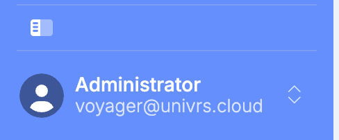
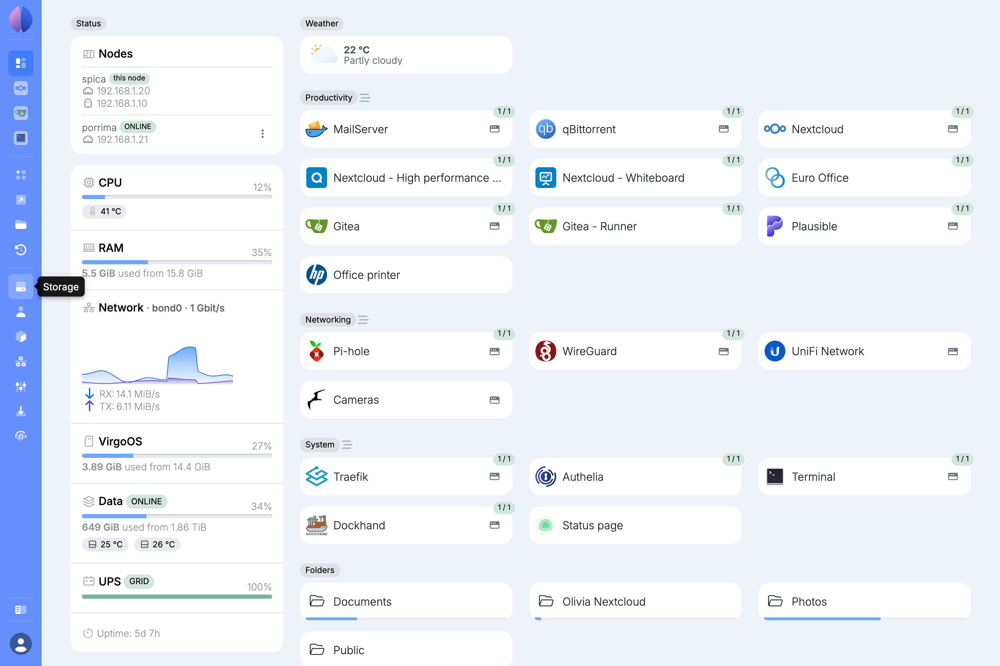

Once setup is finished, you manage the node by signing in at the name you gave it during setup, for example `https://spica.virgo.univrs.cloud`.

## Who sees what

Users without the administrator role see only the **Dashboard** and their own [profile](/management/system/users/profile/). From the **Dashboard** they can open the apps that are gated by a node account, but each app still decides whether they get in.

Every other page in the menu is for [administrators](/management/system/users/#roles) only.

## The menu

The menu on the left lists every page you can open. On a computer screen, select the button at its bottom, above your name, to collapse it and leave more room for the page.

Collapsed, the menu shows only icons. Hover over one to see its name. Select the same button to expand the menu again.

The menu stays the way you left it in this browser. When it is longer than the screen, scroll it: a shadow at its top or bottom edge shows there is more in that direction.

## Topics

- [Authentication](/management/authentication/): signing in and out, and what is gated by an account.
- [Dashboard](/management/dashboard/): the node's status, its nodes, apps, shortcuts, folders and time machines at a glance.
- [UPS](/management/ups/): what the node does during a power cut, and when it shuts itself down.
- Resources
  - [Apps](/management/resources/apps/): installing apps from the App center and managing them.
    - [Snapshots](/management/resources/apps/snapshots/): an app's restore points, and the ways to get files back from them.
      - [Browsing files](/management/resources/apps/snapshots/browse/): looking inside a restore point, seeing what changed since, and selecting what to get back.
      - [Searching files](/management/resources/apps/snapshots/search/): finding earlier and deleted files across every restore point.
      - [Restoring files](/management/resources/apps/snapshots/restore/): putting one file or a whole selection back into Nextcloud.
  - [Shortcuts](/management/resources/shortcuts/): links on the Dashboard to devices and websites, optionally reached through the node.
  - [Folders](/management/resources/folders/): shared folders for the computers on your local network.
  - [Time machines](/management/resources/time-machines/): backup destinations for the Time Machine app on Macs.
- System
  - [Storage](/management/system/storage/): the storage pool, its health, data integrity, usage and drives.
  - [Users](/management/system/users/): the people who can sign in and their roles.
    - [Your profile](/management/system/users/profile/): your own name, email address and password.
  - [Services](/management/system/services/): the system services on the node, their logs, and starting or stopping them.
  - [Network](/management/system/network/): the node's name, its network interface and trusted proxies.
  - [Settings](/management/system/settings/): fleet, notifications, location and the weather, and power.
  - [Updates](/management/system/updates/): keeping virgoOS up to date.
  - [About](/management/system/about/): the versions of the software on the node and its hardware.
