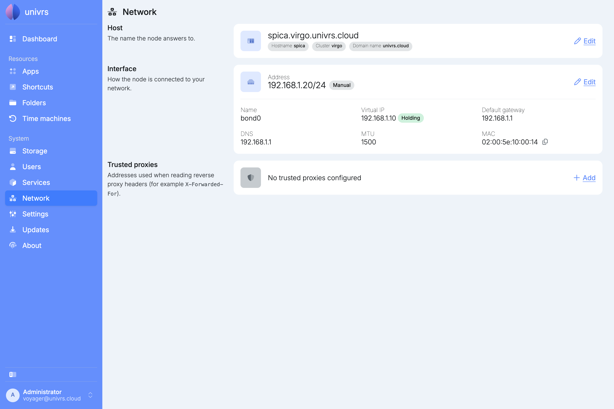
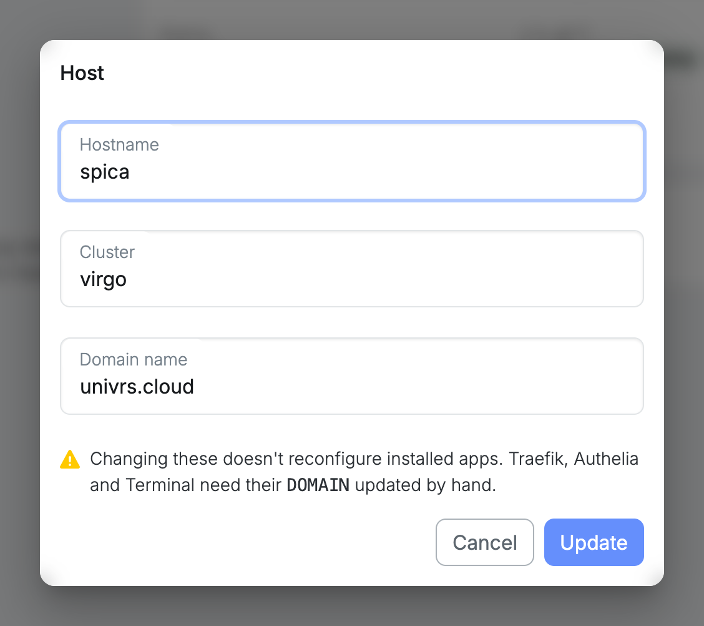
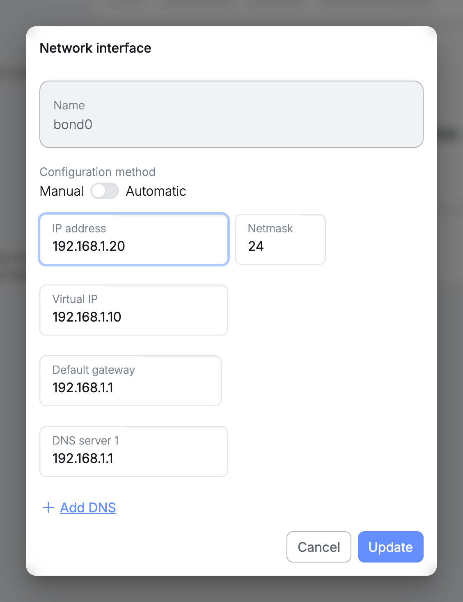
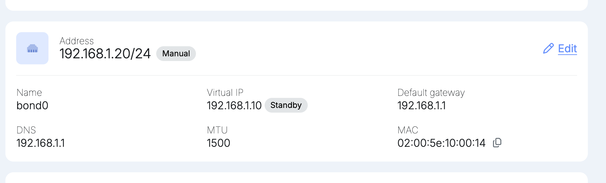
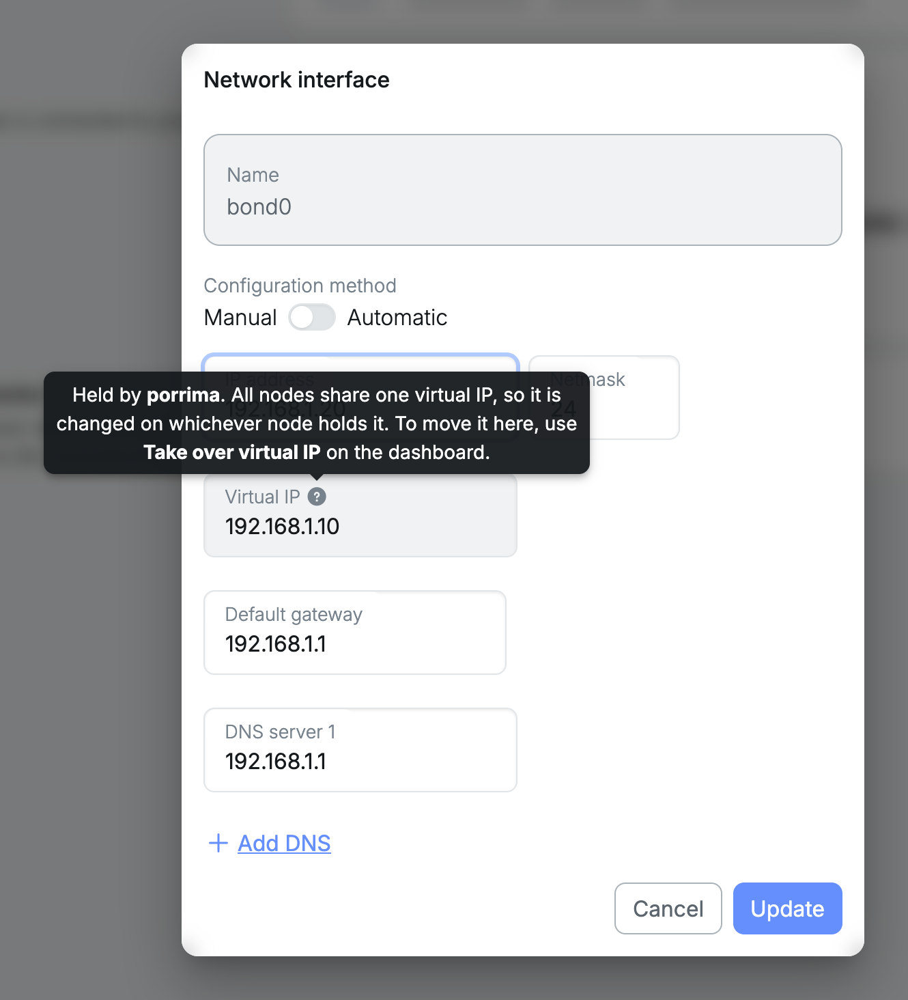
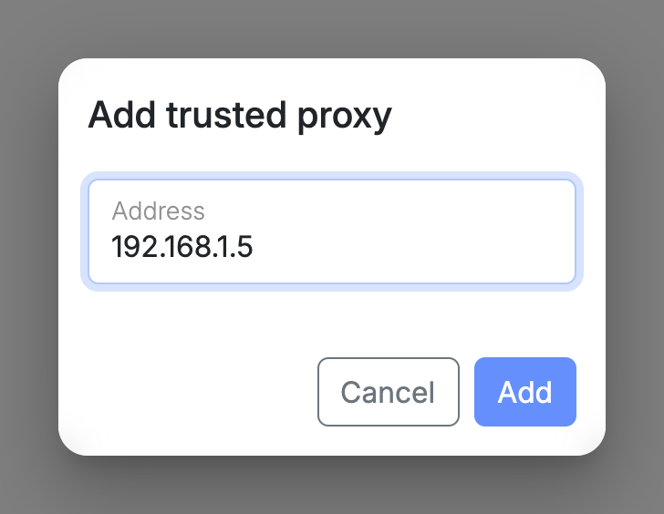
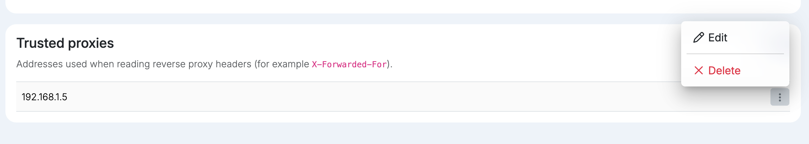

**Network** shows the name the node answers to, how it is connected to your network and which proxies it trusts.

## Host

The **Host** card shows the name the node answers to: its hostname, cluster and domain name, for example `spica.virgo.univrs.cloud`. Select **Edit** to change them.

:::caution
Changing the host does not reconfigure the apps that are already installed. Traefik, Authelia and Terminal need their `DOMAIN` setting updated by hand.
:::

If another node on the network already belongs to a cluster, the cluster and domain are locked to that cluster.

## Interface

The **Interface** card shows the node's network connection: its address, virtual IP, default gateway, DNS servers, MTU and MAC address.

The badge next to the virtual IP says which node carries it:

- **Holding:** this node answers on the virtual IP.
- **Standby:** this node shares the virtual IP, but another node holds it at the moment.
- **On** followed by a node name: another node on the network has a virtual IP, and this node is not part of it.

Select **Edit** to change the IP address, netmask, virtual IP, default gateway or DNS servers. Use **Add DNS** for up to three DNS servers.

The virtual IP is the address the node's name, its apps and your router's port forwarding point to, so it is shared by all the nodes in a cluster. It can only be changed on the node that holds it, or while no node on the network has one yet.

On a node on standby, the virtual IP is locked. The **?** next to it explains which node holds it; to move it to this node, use **Take over virtual IP** on the **Dashboard**.

If another node on the network has a virtual IP and this node is not part of its cluster, the field is locked too. Adopt this node from the **Dashboard** of the node holding the virtual IP, to share it instead of configuring a second one.

## Trusted proxies

If you put another reverse proxy in front of the node, add its IP address here. The node then reads each visitor's real address from the headers that proxy adds, such as `X-Forwarded-For`. That address decides, for example, whether a visitor counts as being on your local network. The node's own proxy is already trusted.

Select **Add** and enter the proxy's IP address.

Open a proxy's menu to **Edit** or **Delete** it.

