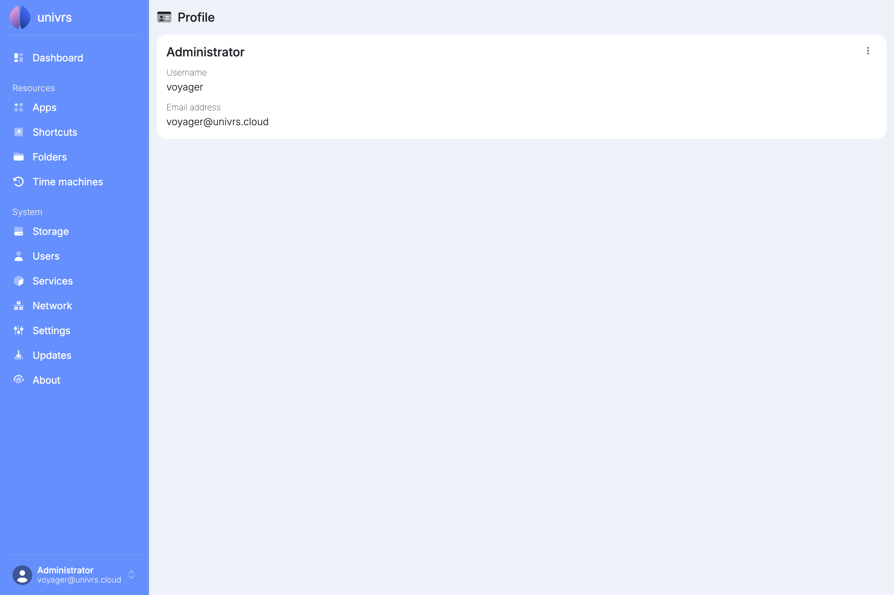
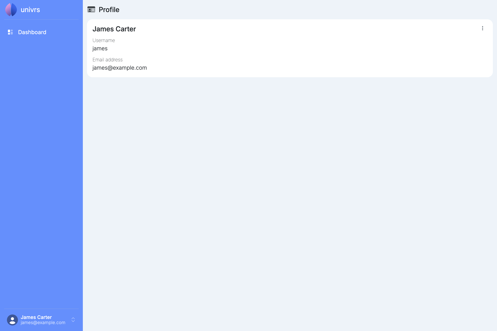
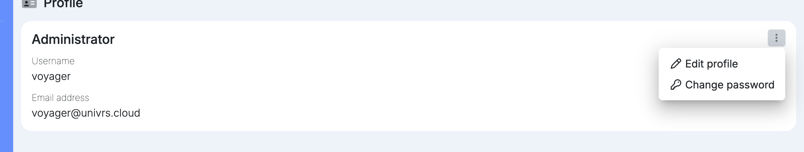
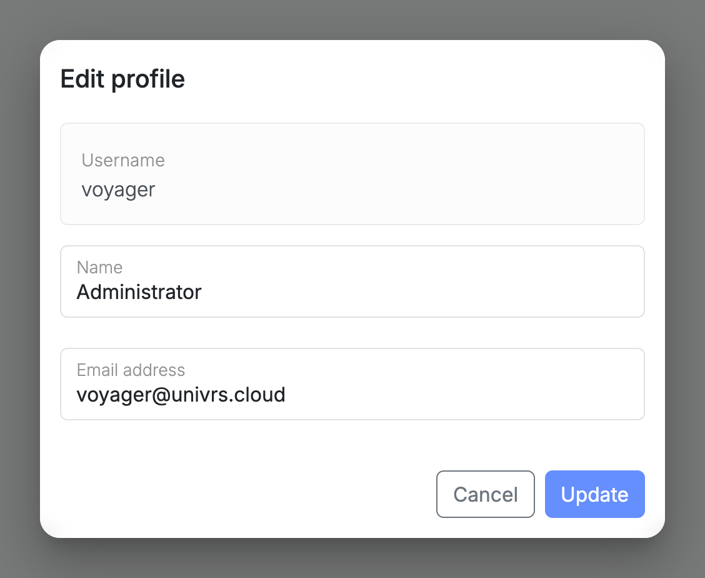
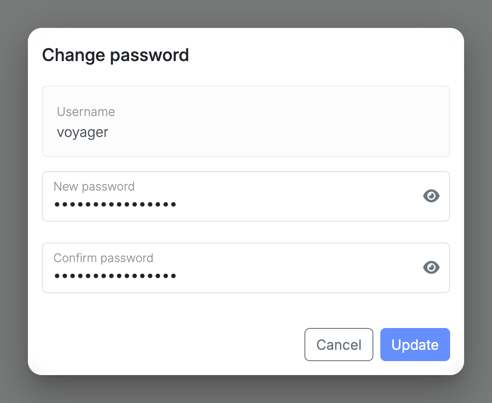

Every signed-in user has a profile, whatever their role. Open it from the account menu with your name, then select **Your profile**.

It shows your name, username and email address.

A user without the administrator role sees only the dashboard and their profile.

## Editing your profile

Open the menu on your profile card, then select **Edit profile** to change your name and email address.

## Changing your password

Open the menu on your profile card, then select **Change password** and enter the new password twice.

Your new password is used everywhere on the node from then on.
