**Apps** lists the apps installed on the node. The core apps installed during [setup](/setup/apps/) are always there; every other app is installed from the **App center**.

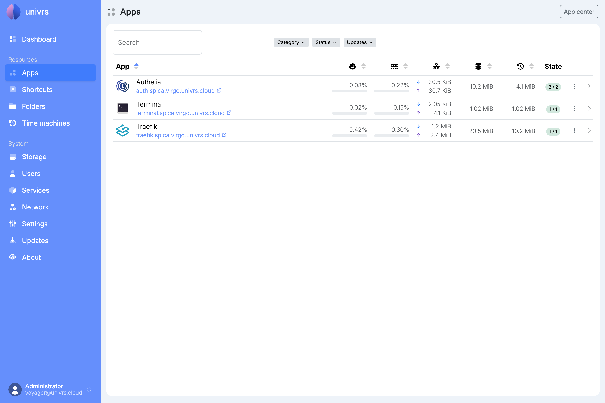

For each app, the list shows its name and addresses, how much CPU, RAM and network it uses, how much space its data and its snapshots take up, and its state: how many of its containers are running, green when all of them are, yellow when only some are, and red when none are. Select an address to open the app. Sort the list by name or by any of the figures with the arrows in the column headers, and use **Search** to find an app by its name or address.

Narrow the list down with the filters next to **Search**: **Category**, **Status** for whether the app is running, partly running or stopped, and **Updates** for whether an update is available. A filter in use turns blue, and **Clear filters** removes them all.

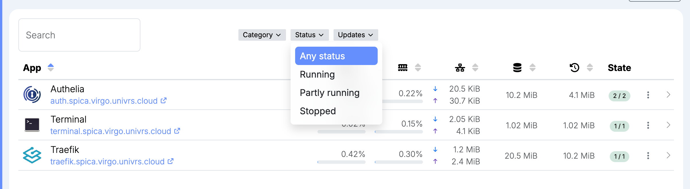

## Installing an app

Select **App center**. **Explore** lists the apps you can install, and **Installed** the ones already on the node.

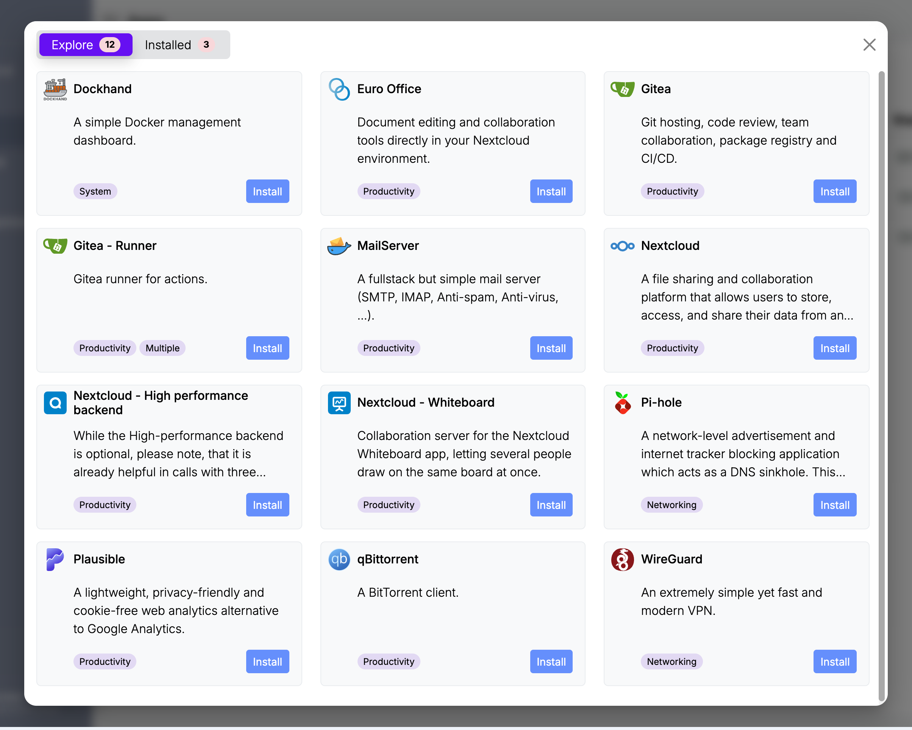

Select **Install** on an app. The form describes the app, shows any note that comes with it, such as a port to forward on your router, and asks for the settings it needs. **Domain** is filled in with the node's domain, and the app is reached at its own name under it, for example `nextcloud.virgo.univrs.cloud`.

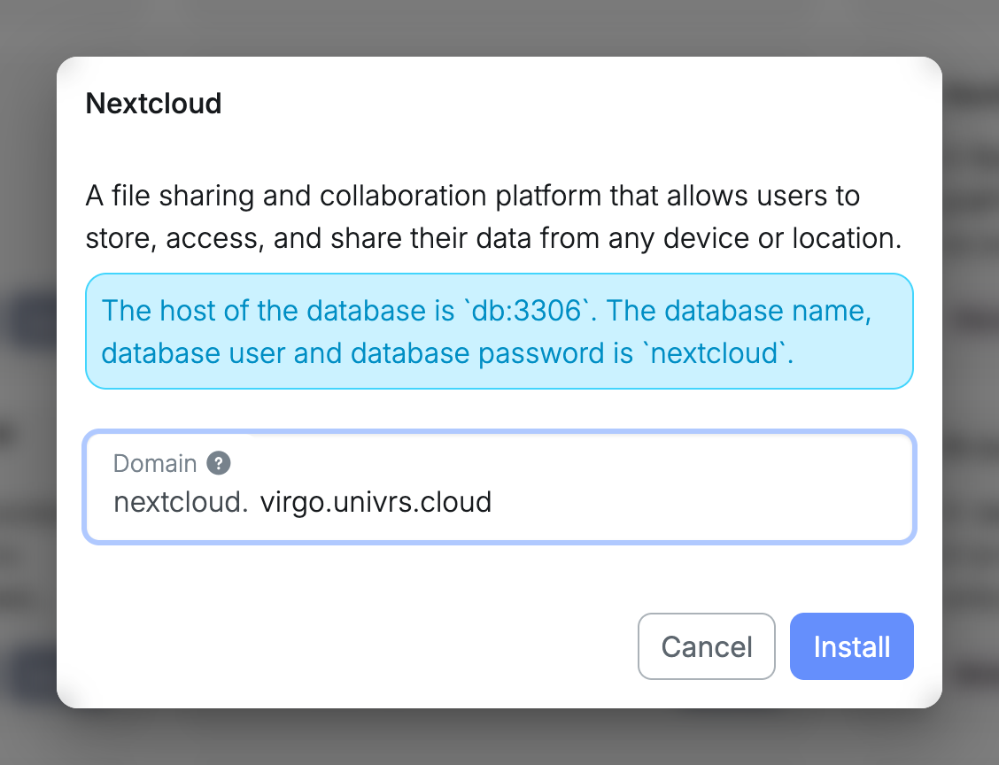

With a domain of your own, you also choose the app's HTTPS certificate, starting from the one the node uses:

- **Let's Encrypt:** when the domain's DNS points to your network and port 80 is [forwarded](/setup/ports/) to the node. Browsers trust it everywhere.
- **Self-signed:** when port 80 is not forwarded, for example when the node is only used on your local network or is behind CGNAT. Browsers warn about it until you accept it.

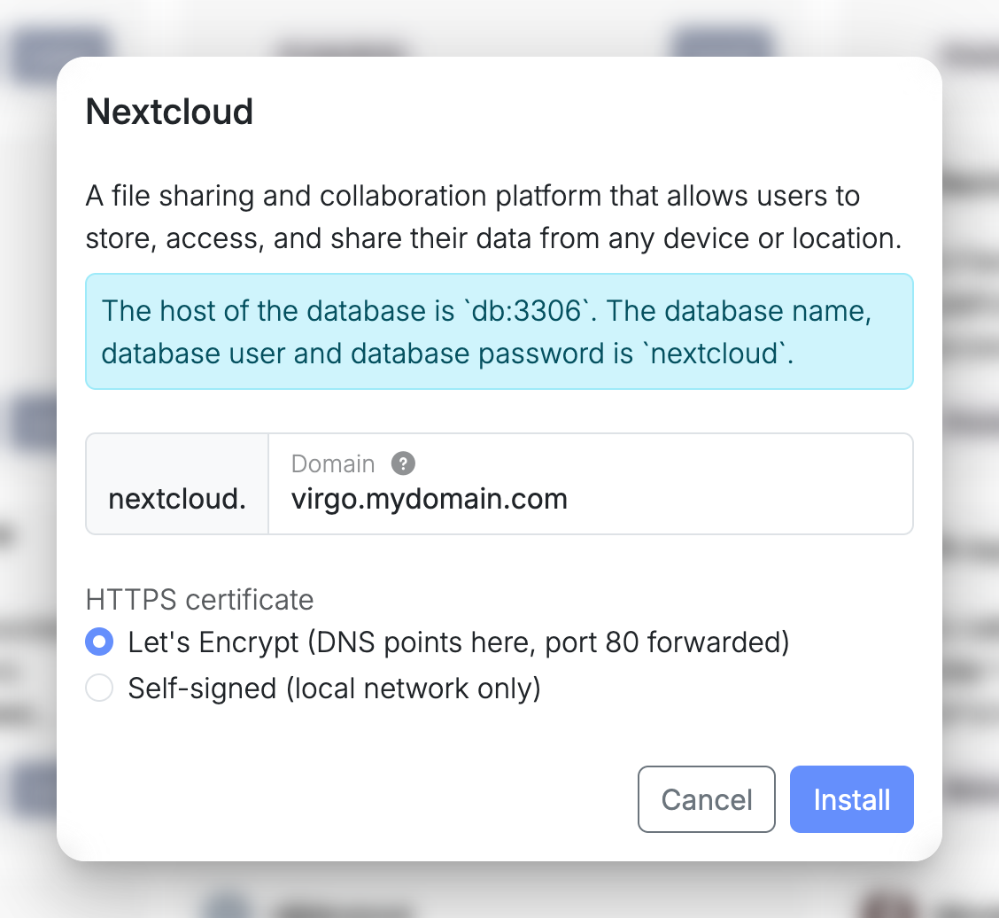

While the app installs, its card shows **Installing...**. The node makes room for the app's data in the storage pool, downloads the app and starts it, and the app then appears in the list.

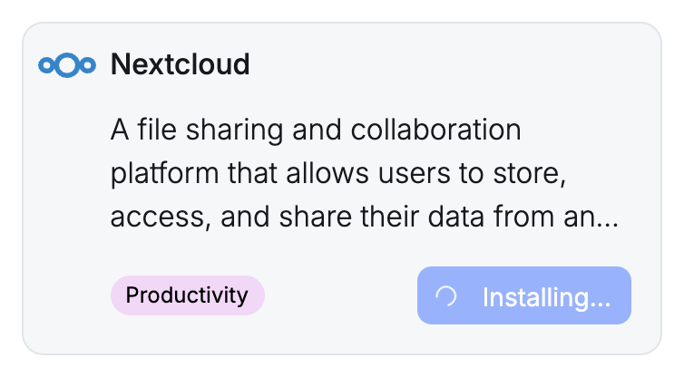

## Managing an app

Open an app's menu in the list, or use the buttons at the top of its details:

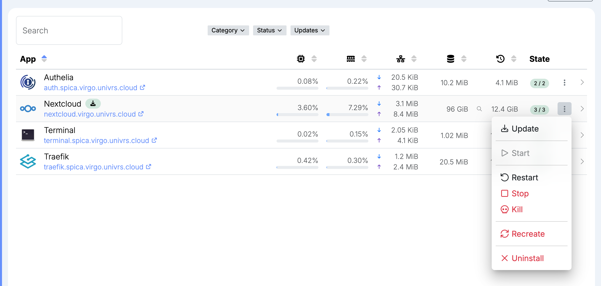

- **Update:** when an update is available, bring the app up to date. See [Updating an app](#updating-an-app).
- **Start**, **Restart** and **Stop:** start, restart or stop all of the app's containers.
- **Kill:** stop the app at once, without giving it time to shut down properly. Use it when **Stop** does not work.
- **Recreate:** rebuild the app's containers from its template in the App center, keeping its settings and data. Use it when an app misbehaves.
- **Uninstall:** remove the app. Its data stays in the storage pool, and installing the app again picks it back up.

The core apps cannot be stopped, killed or uninstalled, because the node needs them.

While an action is running, a spinning gear takes the place of the menu.

### Updating an app

The node checks for app updates every day at midnight. When one is available, a green download badge appears next to the app's name. Select **Update** in its menu.

A notification follows the update while a spinning gear takes the place of the app's menu. The node fetches the app's latest template, downloads the new version of each of its containers, and restarts the app on it.

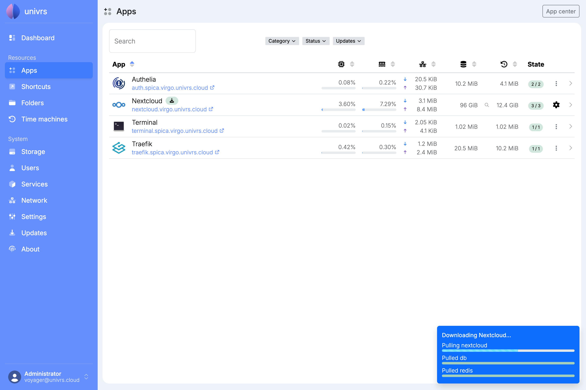

When the update finishes, the notification says so and the badge disappears. The app keeps its settings and data.

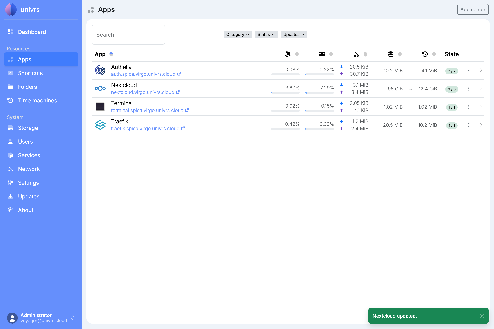

## An app's details

Select an app to open its details. **Services** shows the app's containers, and **Snapshots** its [snapshots](/management/resources/apps/snapshots/), with how many of each there are.

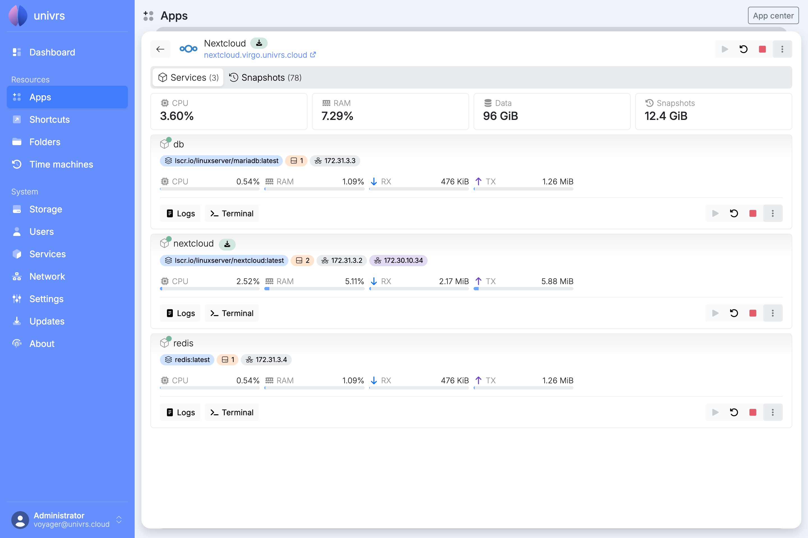

At the top are the app's CPU and RAM use, and the space its data and snapshots take up. Below are the app's containers, each with its image, the folders it mounts, its network addresses and ports, and how much CPU, RAM and network it uses. Hover over a badge for more, such as where each folder is mounted from. Each container can be started, restarted, stopped or killed on its own.

### Logs

Select **Logs** under a container to see its last 200 lines of output, followed by new lines as they come in.

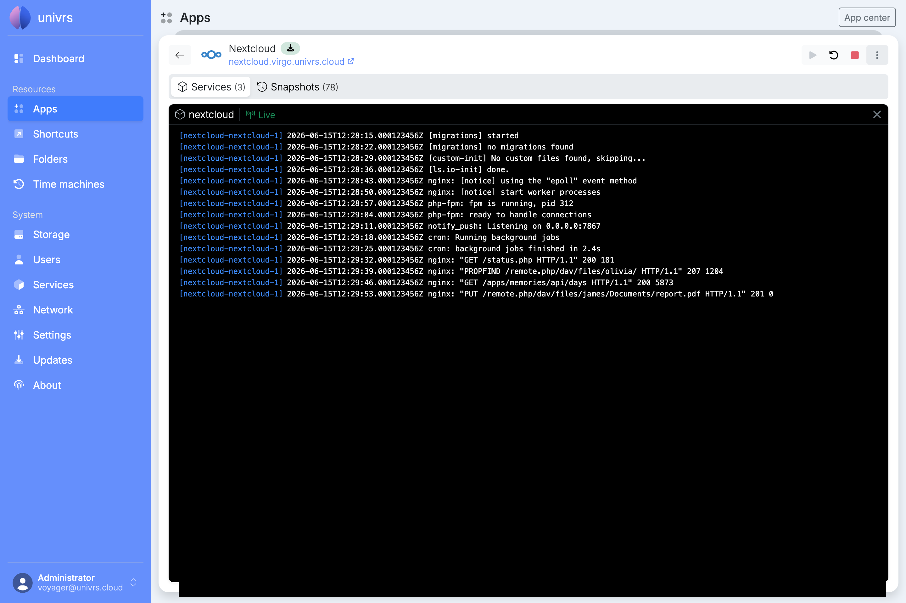

### Terminal

Select **Terminal** under a running container to open a command line inside it. Anything you change there outside the app's data is lost when the app is recreated or updated.

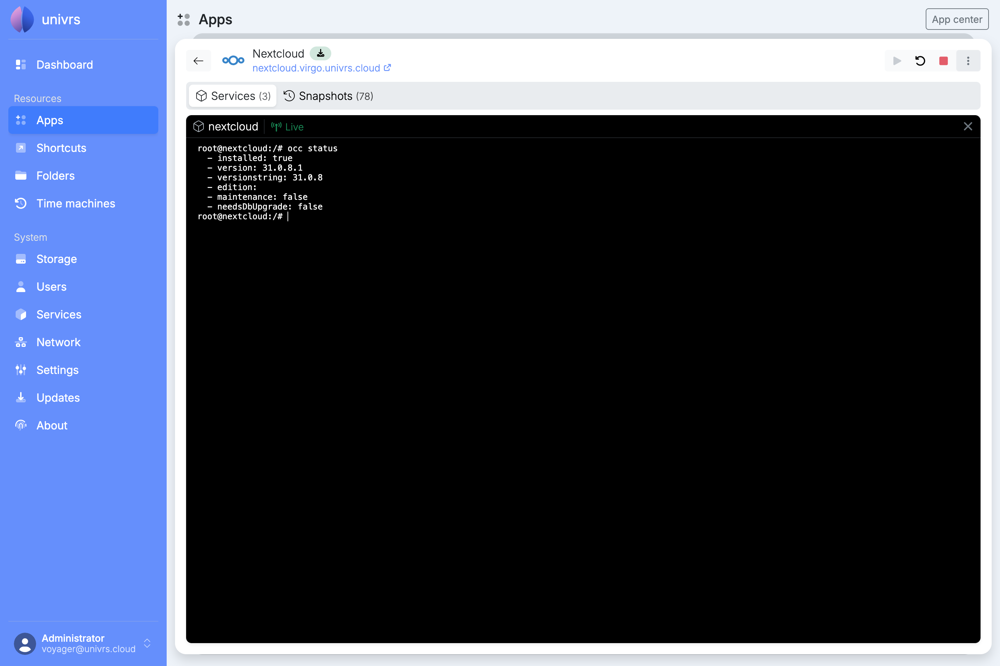
