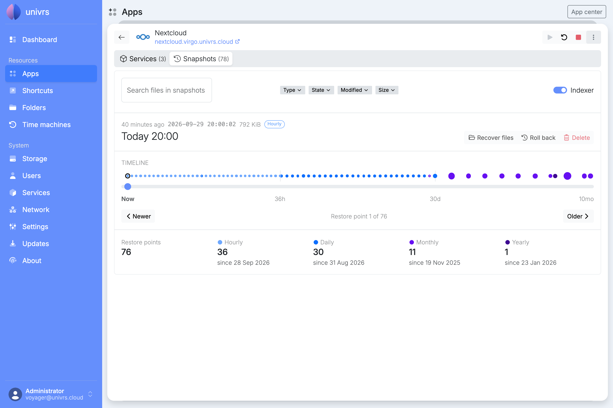
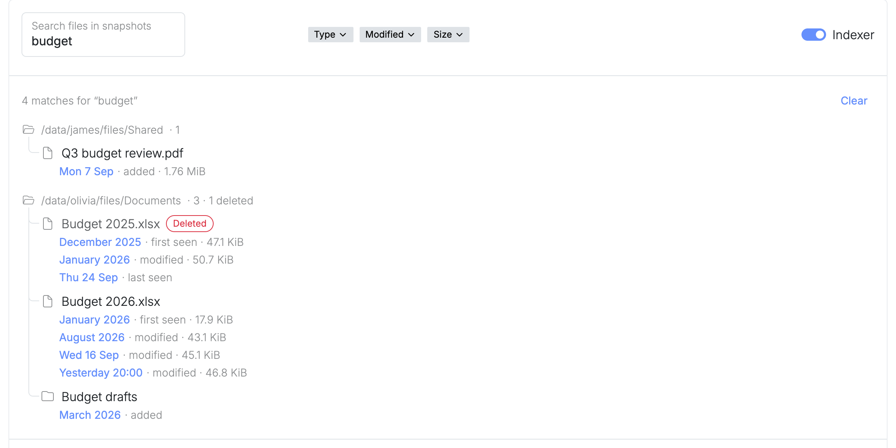

A snapshot is a read-only copy of an app's data as it was at one moment. The node takes them by itself and removes old ones, following the pool's [snapshot schedule](/management/system/storage/#usage). A snapshot only takes up space for what has changed since it was taken, so keeping many of them costs little.

Open an app's details and select **Snapshots**.



## Restore points

Snapshots taken at the same moment by different schedules, such as the daily and the monthly one at midnight on the first of the month, are shown together as one restore point.

The selected restore point shows when it was taken, the space it takes up, and the schedules that keep it: **Frequently**, **Hourly**, **Daily**, **Monthly** or **Yearly**. The space is the data that only this restore point still holds, which is what deleting it would free.

### Timeline

The timeline runs from **Now** on the left to the oldest restore point on the right. Each schedule gets an equal stretch of it, so the many recent restore points are spread out and the few old ones fit in too. The marks under it show how far back each stretch reaches.

Each dot is a restore point. The bigger the dot, the more space it takes up, and a hollow dot holds nothing that the others do not. Hover over a dot to see its details.

To choose a restore point, select its dot, drag the slider, or use **Newer** and **Older**. With the slider selected, the arrow keys step from one restore point to the next.

On a narrow screen, the timeline becomes a set of orbits around the app's icon, one per schedule, going round clockwise from **Now**.

Below, the page counts the restore points, and how many each schedule keeps and since when.

### Recovering, rolling back and deleting

**Recover files**, **Roll back** and **Delete** are coming soon. Until then, see [Recovering files](#recovering-files).

## Searching files

When the app's **Indexer** is on, its snapshots are added to the [indexer](/management/dashboard/#indexer)'s catalogue of files, and you can search it for earlier and deleted versions of the app's files. Turn it on with the switch at the top right of **Snapshots**. The indexer catalogues new snapshots every hour, so files show up in the search after its next run.

Type part of a file's name, or of a folder it is in, into **Search files in snapshots** and press Enter.



The results are shown as a tree of the folders they are in. A file that no longer exists is marked **Deleted**. Under each file are the restore points that hold a version of it, with what happened to it there, such as **added**, **modified** or **last seen**, and its size. Select a restore point to show it on the timeline.

Narrow the search down with **Type** for files or folders only, **State** for files that still exist, were changed, renamed or moved, never changed or deleted, **Modified** for when the file was last changed, and **Size**. When there are more results, **Load more** shows the next ones, and **Clear** removes the results.

## Recovering files

Recovering files from **Snapshots** is coming soon. Until then, find the file with the [`virgo indexer`](/cli/indexer/) commands on the node:

```sh
virgo indexer search report.pdf
```

Each result shows where the file is now, or, if it was deleted, the path to recover it from inside the snapshot that still holds it. Copy the file back from there. `virgo indexer history` lists every version of a file, and `virgo indexer deleted` the files that were deleted.
