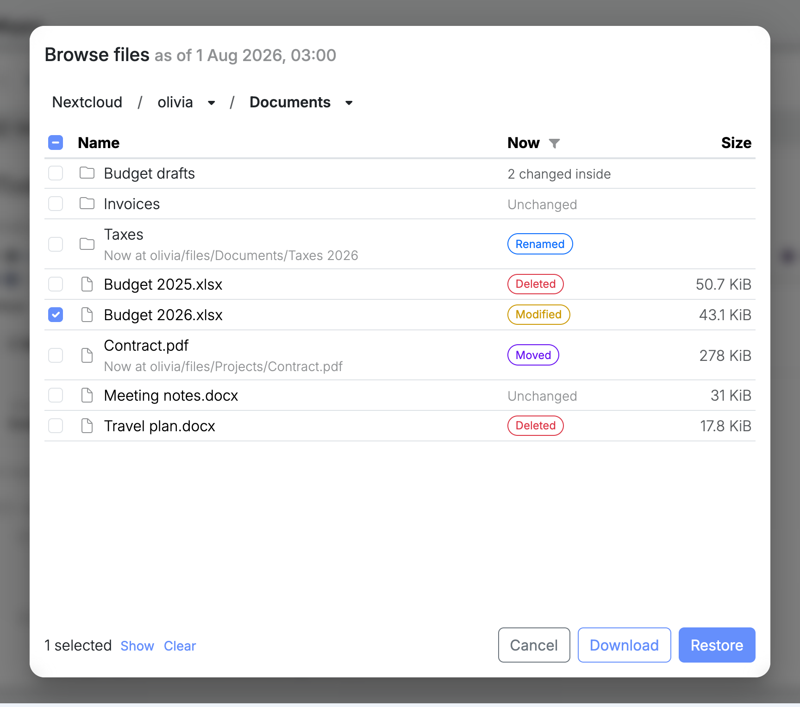
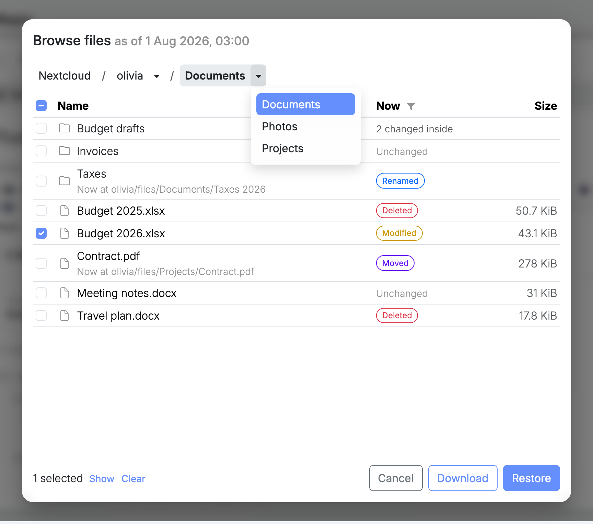
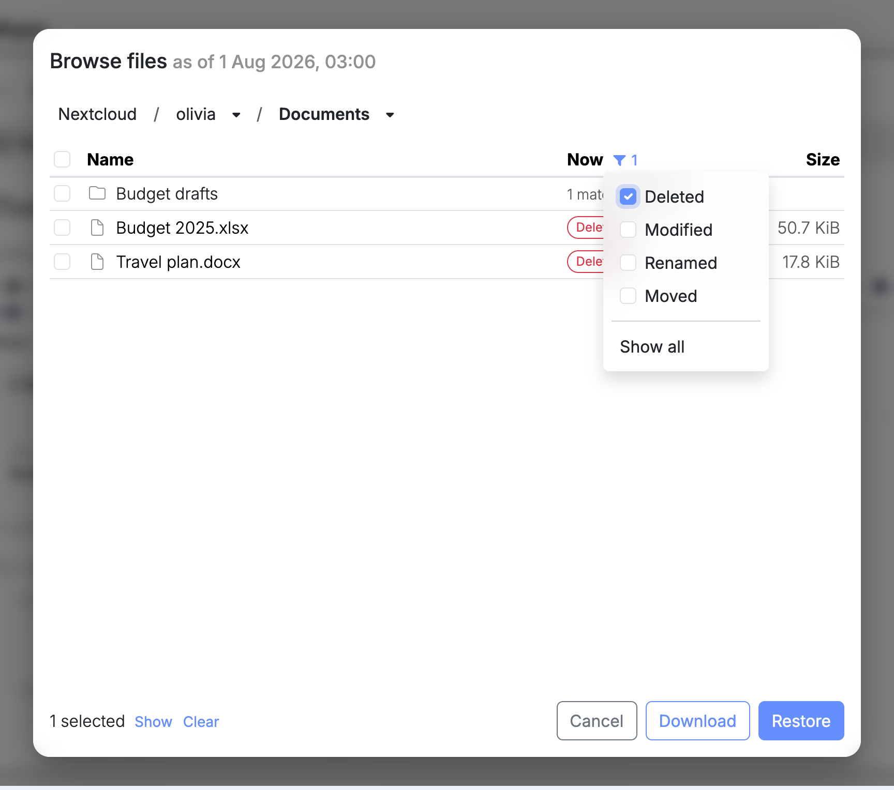
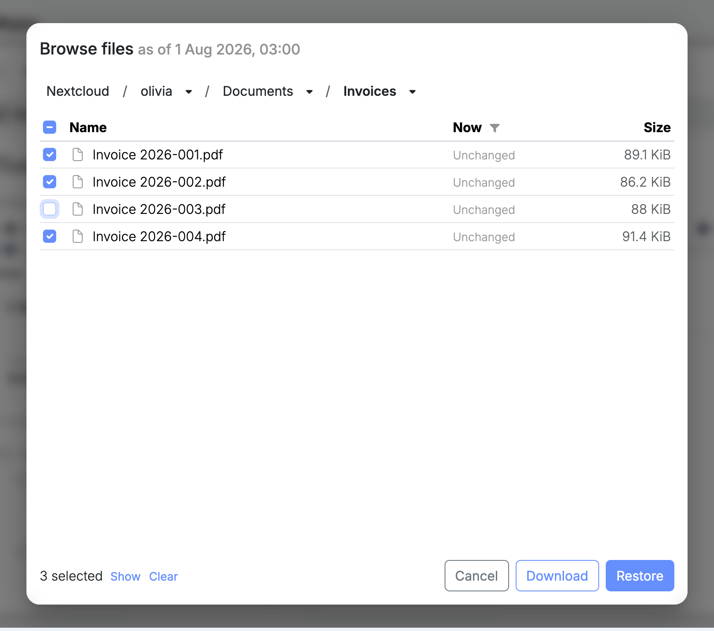
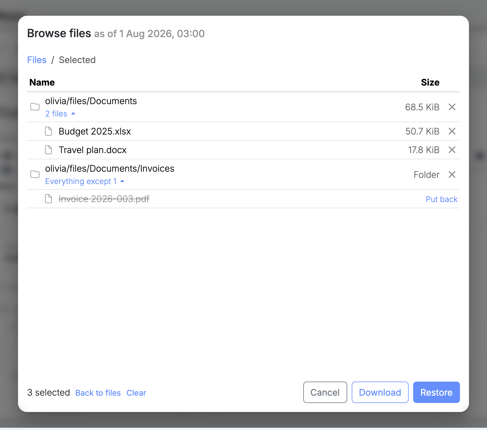

**Browse files** opens Nextcloud as it was at one restore point. You walk through everyone's folders the way they were then, see at a glance what has been changed, moved or deleted since, and tick what you want back.

It is the place to start when you know roughly when things were still right: before a folder was cleaned out, before a sync went wrong, before someone left.

## Opening a restore point

1. Open Nextcloud's details and select **Snapshots**.
2. Choose a restore point on the [timeline](/management/resources/apps/snapshots/#timeline).
3. Select **Browse files**.

The title shows the date you are looking at.

You can also get here from a [search result](/management/resources/apps/snapshots/search/#opening-a-result-in-browse-files), which opens the right folder at the right date.

## Finding your way

The first level lists the Nextcloud users. Select a name to open it, and keep going down through the folders.

The path at the top always shows where you are:

- Select a name in the path to go back up to that folder.
- Select the arrow next to a name to list the folders at that level, and jump sideways to another one without going up first.

The path and the column headings stay in place while the list scrolls.

## What changed since then

The **Now** column compares each file and folder with what Nextcloud holds today. It answers the question you came with: is this still there, and is it still the same?

| Now | What it means |
| --- | --- |
| **Unchanged** | Still there and still the same. Nothing to get back. |
| **Modified** | Still there, but its content has changed since. The restore point holds the earlier version. |
| **Renamed** | Still there under another name, shown under it as **Now at**. |
| **Moved** | Still there in another folder, shown under it as **Now at**. |
| **Deleted** | No longer there. Something that sits in someone's Nextcloud trash counts as deleted too. |

A folder also says how much is going on beneath it. **3 changed inside** means three files somewhere inside it, at any depth, are modified, renamed, moved or deleted, so you know which folders are worth opening.

When the folder you are in was itself moved or deleted later, a line under the path says so.

The comparison is as fresh as the node's catalogue, which is updated every hour at ten past. Two things follow from that:

- The newest restore point shows everything as **Unchanged**, because nothing has been catalogued after it yet.
- A restore point taken since the last run has no comparison yet. You can browse and select as usual, and a note says the changes are not shown.

## Showing only what changed

A big folder is mostly unchanged files. To see only what matters, select the filter button next to **Now** and tick what you are looking for: **Deleted**, **Modified**, **Renamed** or **Moved**. Tick more than one to combine them.

The list then shows the files that match, and the folders that have matches somewhere inside, each with how many. Open those folders as usual: the filter stays on while you move around, so you can follow a trail of deleted files down through the folders without wading through the rest.

The filter button turns blue and shows how many states are ticked. **Show all** turns the filter off. The filter is available once you are inside a user.

## Selecting files and folders

Tick the box in front of anything you want. The selection is kept while you move between folders, so you can collect files from several places, and from several users, in one go.

- Ticking a folder selects everything inside it.
- The box in the column heading ticks or unticks everything in the list.
- A box with a dash means part of that folder is selected.

Two shortcuts save a lot of ticking:

- **Everything but a few.** Tick the folder, open it, and untick what you do not want. The folder stays selected, without those.
- **Only what changed.** With a [filter](#showing-only-what-changed) on, ticking a folder selects just the matching files inside it, at any depth. Turn on **Deleted**, tick a folder, and you have every file that was deleted from it since.

The bottom of the window always shows how many items are selected.

## Checking the selection

Select **Show** at the bottom to see everything you have collected, instead of the folders.

- A whole folder says **Everything inside**.
- A folder with exceptions says **Everything except**, with how many. Select it to see what is left out, and **Put back** to include a file again.
- Single files from the same folder are kept together under that folder. Select the count to list them.
- The remove button at the end of a line takes it out of the selection.

**Back to files** returns to the folders, and **Clear** empties the selection.

## Downloading the selection

Select **Download** to save the selection to your computer.

- A single file is downloaded as it is.
- Anything more is downloaded as one `.zip` archive. Inside it, the folders start at the one all the selected items share, so two files from **Documents** arrive side by side, and items from two users arrive in a folder per user.
- What you left out of a folder is left out of the archive.

The archive is put together as it downloads, so a large selection starts right away and takes as long as its size. The window stays open with the selection intact, in case you also want to restore it.

Downloads are not available when you manage the node [through your fleet](/management/authentication/#through-your-fleet). Open the node at its own address instead. Restoring works either way.

## Restoring the selection

Select **Restore** to put the selection back into Nextcloud. **Restore files** opens on top, with how many items you selected and the date they come from.

Choose a folder and select **Restore**. Everything arrives there in a new folder of its own, named after the restore point's date, so nothing that is in Nextcloud now gets replaced.

[Restoring a selection](/management/resources/apps/snapshots/restore/#restoring-a-selection) explains what ends up where, and why.
