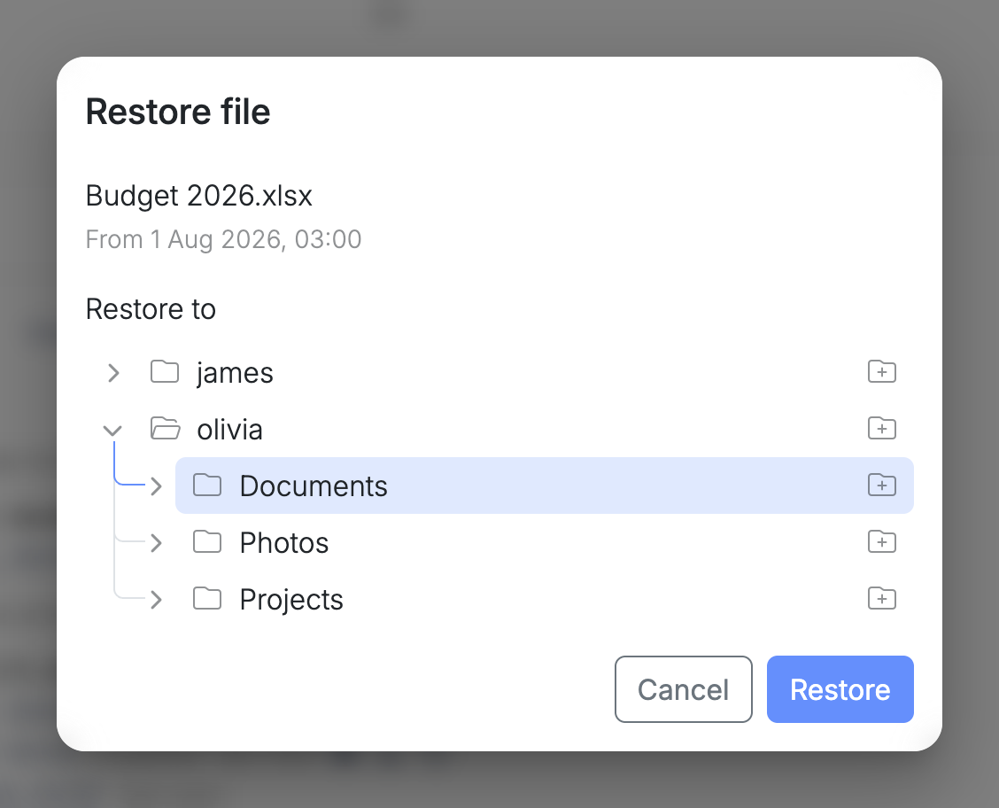
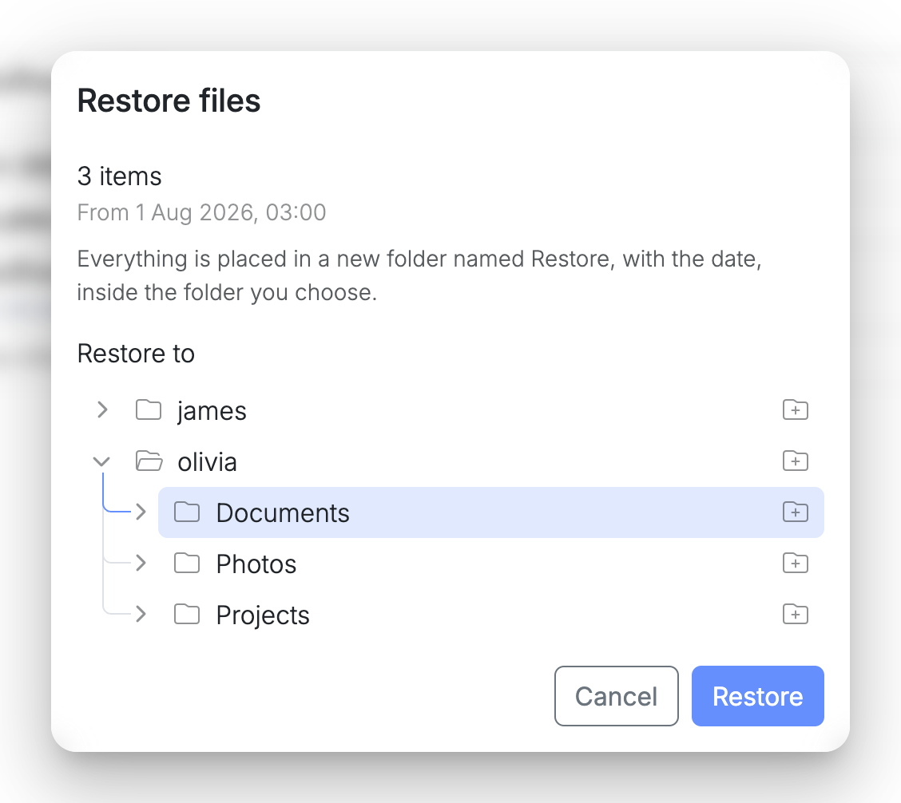
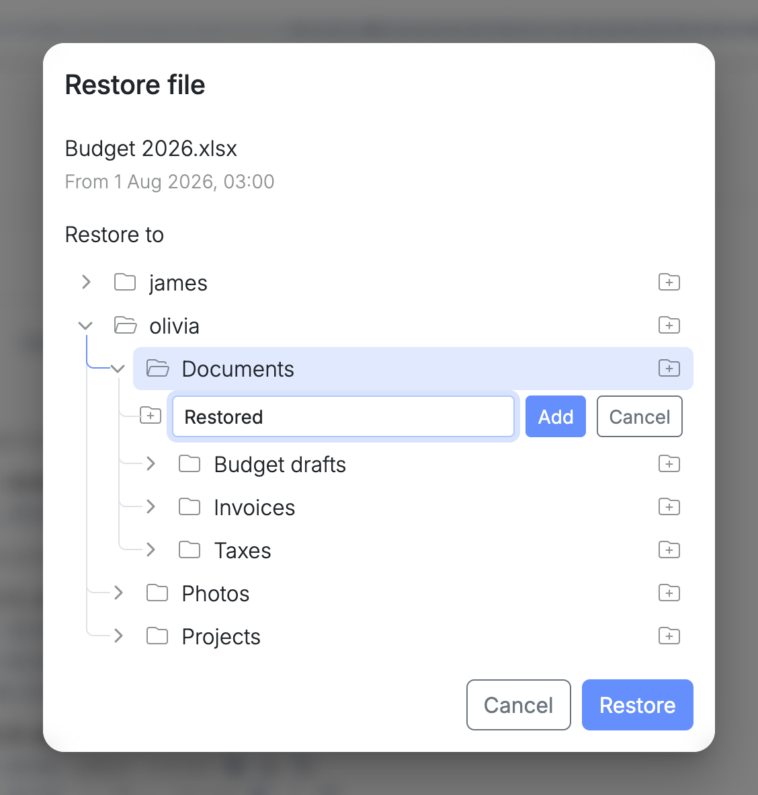
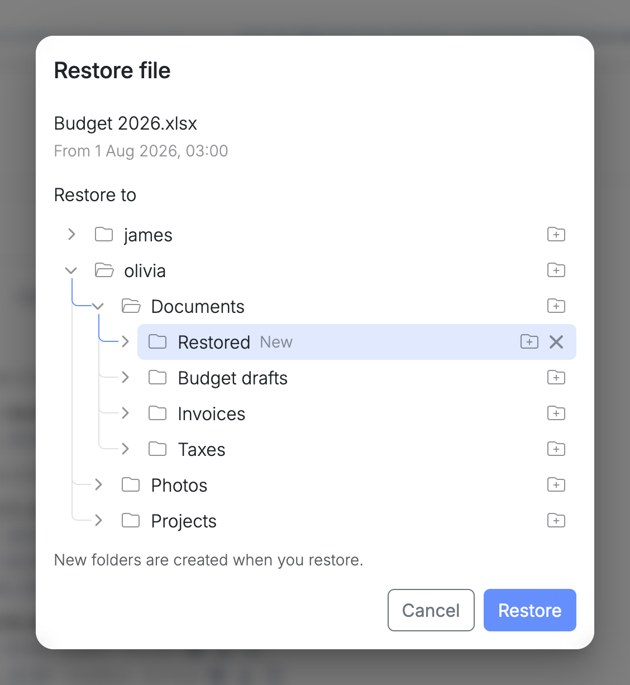

Restoring copies files out of a restore point and back into Nextcloud, where they show up by themselves, for the person whose folder you chose. The restore point itself never changes, so the same files can be restored again.

There are two ways, for two kinds of job:

| | One file | A selection |
| --- | --- | --- |
| Start from | A version in the [search results](/management/resources/apps/snapshots/search/) | **Restore** in [Browse files](/management/resources/apps/snapshots/browse/) |
| What goes back | That one version of the file | Any mix of files and folders |
| Where it lands | Directly in the folder you choose, under its own name | In a new **Restore** folder inside the folder you choose |
| A file with that name is already there | You decide: keep both or overwrite | Cannot happen, the new folder starts empty |

Use the first to put one document back exactly where it belongs. Use the second to bring back a lot at once and sort it out afterwards.

## Restoring one file

In the [search results](/management/resources/apps/snapshots/search/), each version of a file has a restore button next to its download button. It puts that one version back into the Nextcloud folder you choose.

Select the restore button to open **Restore file**, then choose where the file goes:

1. **Restore to** lists every Nextcloud user. Open a user to see their folders, and open a folder to see the folders inside it.
2. Select the folder the file should go to, or [add a new one](#restoring-to-a-new-folder). The folder the file was in at that restore point is already selected. A file from someone's trash has no folder selected, and gets its original name back.
3. Select **Restore**.



What happens next depends on what is in that folder.

### The folder has no file with that name

The file is restored straight away. This is the usual case for a file that was deleted.

### The folder already has a file with that name

Nothing is restored yet. **File already exists** shows the two files side by side, the one in the folder now and the one from the restore point, each with its size and when it was last changed.


Choose what to do:

- **Restore as a copy** keeps the file that is there and puts the restored one next to it, with the restore point's date in its name, such as `Budget 2026 (restored 1 Aug 2026).xlsx`. Nothing is lost.
- **Overwrite** replaces the file that is there with the restored one. The file that was there is gone, unless an earlier restore point still holds it.
- **Cancel** restores nothing and returns to **Restore file**, where you can choose another folder.

In both cases, a notification shows the file being restored and where it ended up.

## Restoring a selection

In [Browse files](/management/resources/apps/snapshots/browse/), select what you want and then **Restore**. **Restore files** opens on top, showing how many items you selected and the date they come from.

1. **Restore to** lists every Nextcloud user. Open a user to see their folders, and open a folder to see the folders inside it.
2. Select the folder everything should go to, or [add a new one](#restoring-to-a-new-folder).
3. Select **Restore**.



The node creates a new folder inside the one you chose, named after the restore point's date, such as `Restore (1 Aug 2026)`, and places everything in it. If a folder with that name is already there, the new one gets a number: `Restore (1 Aug 2026) 2`.

A selection always goes into a folder of its own, for good reasons:

- **Nothing in Nextcloud is replaced.** Whatever is in the chosen folder now stays exactly as it is, so there is no question to answer about files that already exist.
- **It works when the original place is gone.** A selection can come from several folders and several users, and some of them may no longer exist. The owner of a deleted account has nowhere to restore to, but their files can go to a colleague.
- **You decide what happens next.** The person opens the folder in Nextcloud, compares, moves what they need to where they want it and deletes the rest.

Inside the new folder, things are laid out like in a [downloaded archive](/management/resources/apps/snapshots/browse/#downloading-the-selection): the folders start at the one all the selected items share, and what you left out of a folder is left out here too. Files and folders keep the dates they had.

Both windows close when the restore starts. A notification shows it running, counts the files as they are copied, and ends with how many were restored and where. A large selection takes as long as copying it takes. If it cannot be finished, the new folder is removed again, so a restore is either complete or leaves nothing behind.

## Restoring to a new folder

Both ways of restoring can also go to a folder that does not exist yet:

1. Select the new folder button at the end of the folder the new one should be in.
2. Type a name and select **Add**, or press Enter.



The new folder is marked **New** and is selected already. It can hold more new folders, and the remove button next to it takes it out again, with anything added inside it. Folders that already exist cannot be removed here.



A new folder only exists in this window until you select **Restore**. Only then is it created, and only where things are actually placed: the folders that lead there. Any other folders you added along the way are never created, and closing the window without restoring creates nothing.

When you restore one file and the folder it was in no longer exists, that folder is added as a new folder and selected already, so restoring puts the file back where it was.

## From the command line

To copy a file back on the node itself, find it with the [`virgo indexer`](/cli/indexer/) commands on the node:

```sh
virgo indexer search report.pdf
```

Each result shows where the file is now, or, if it was deleted, the path to recover it from inside the snapshot that still holds it. Copy the file back from there. `virgo indexer history` lists every version of a file, and `virgo indexer deleted` the files that were deleted.
