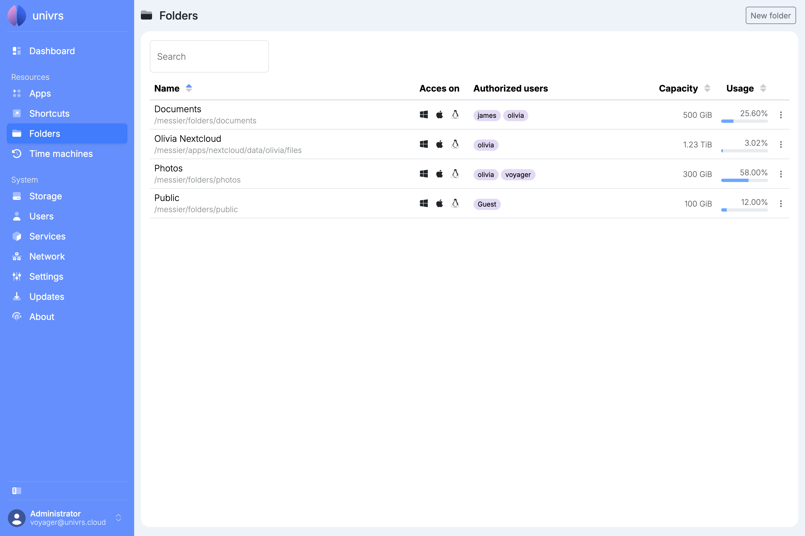
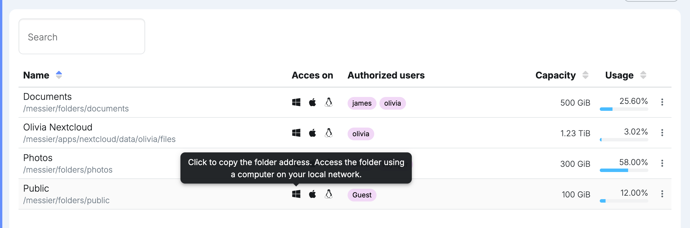
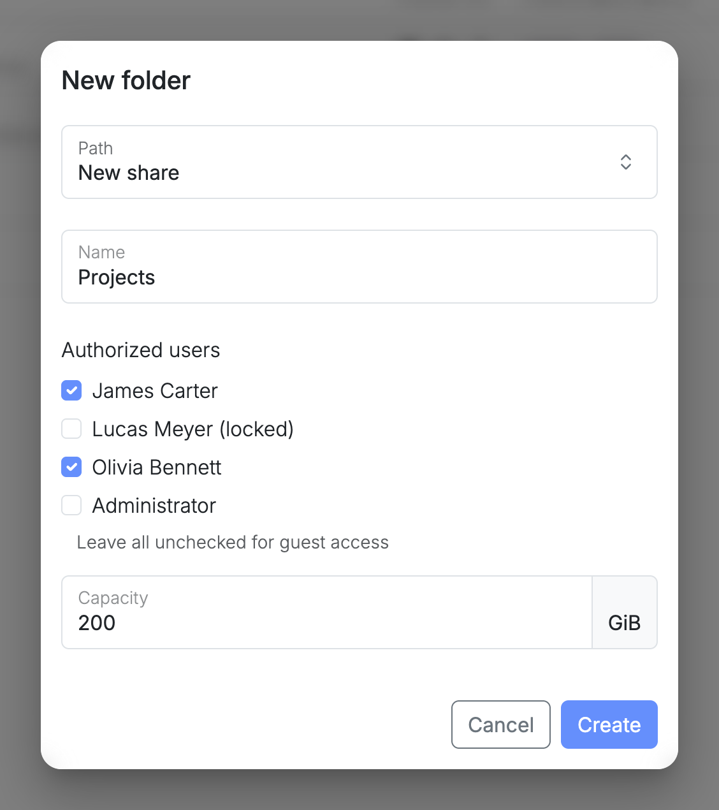
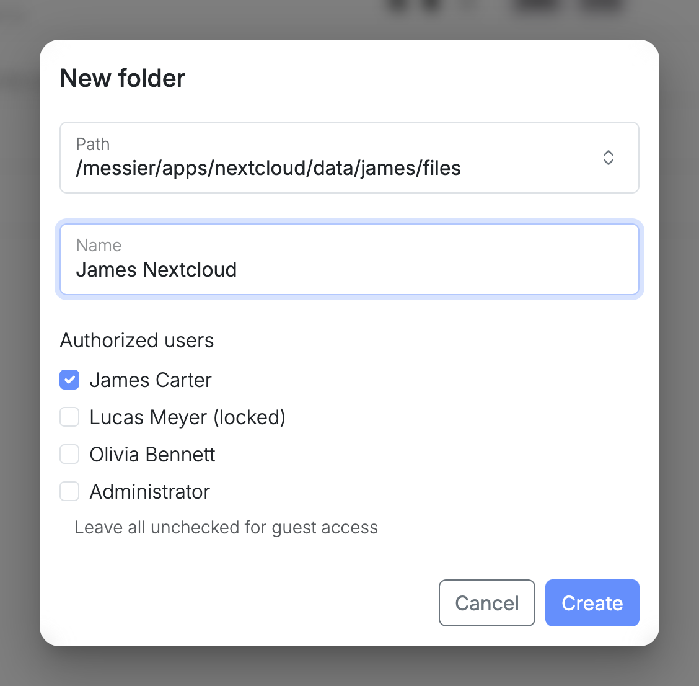
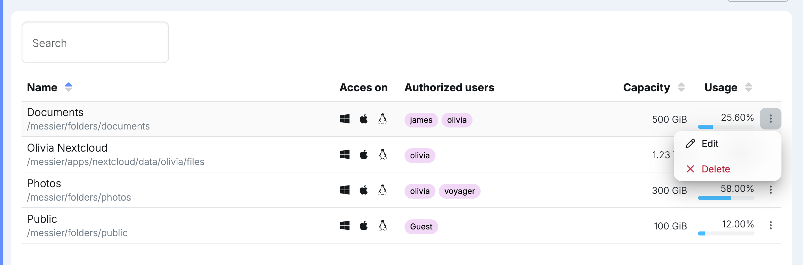
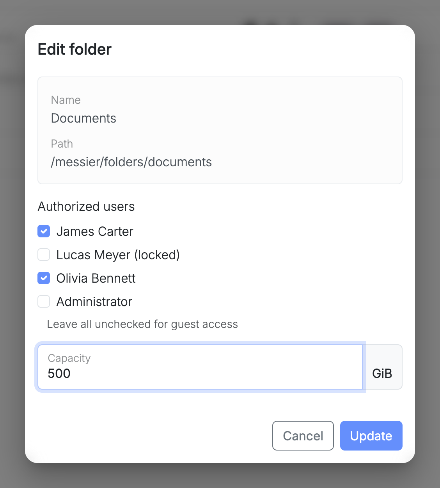
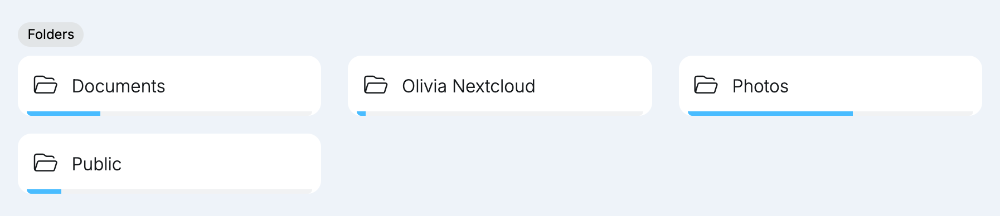

**Folders** are shared folders on the node that the computers on your local network can open, whether they run Windows, macOS or Linux. Users reach them with their node username and password, unless the folder is open to everyone on the network.

For each folder, the list shows its name and path, the users who can reach it, its capacity and how much of it is used. Sort the list by name, capacity or usage with the arrows in the column headers, and use **Search** to find a folder by its name, path or users.

## Opening a folder

Select the Windows, Apple or Linux icon next to a folder to copy its address for that system:

- **Windows:** `\\192.168.1.20\documents`, to paste in File Explorer's address bar.
- **macOS:** `smb://192.168.1.20/documents`, to paste in Finder after pressing **⌘K**.
- **Linux:** `smb://192.168.1.20/documents`, to paste in your file manager's address bar.

When asked, enter your node username and password. A folder marked **Guest** has open access: anyone on your local network can open it and change its files, without a username or password.

The computer reaches the node over your local network only, so folders open while it is on the same network as the node.

Locking a user stops them from reaching every folder, until they are unlocked.

## Scanning to a folder

A folder is also a good place for a scanner or multifunction printer to save its scans. A device that can scan to a network folder (often called scan to folder or scan to SMB) saves each scan straight to the node, where everyone who can reach the folder finds it.

Give each device a [user](/management/system/users/) of its own, then use the folder's **Authorized users** to decide two things at once: which devices can save scans there, and which people can open them. A folder for the accounting office, for example, lists that office's scanner and the people who work there, and nobody else.

In the device's settings, enter the node's address and the folder's name, as they appear in the folder's address, together with the device's own username and password. If a device is replaced or lost, locking or deleting its user cuts its access without touching anyone else's.

This works with Nextcloud too. [Share an existing path](#sharing-an-existing-path), such as a Nextcloud group folder or a user's files, and authorize the device on it: the scans land in Nextcloud, where the same people find them from their browser or phone.

## Adding a folder

Select **New folder**, then enter:

- **Path:** keep **New share** to create an empty folder, or choose an existing path to share what is already there.
- **Name:** what the folder is called.
- **Authorized users:** the users who can reach it. Leave them all unchecked for **Guest**, open access for anyone on your local network.
- **Capacity:** how much space the folder can take up, in GiB. Only for a new share.

### Sharing an existing path

The existing paths are places on the node that already hold files, such as a Nextcloud user's files or a Nextcloud group folder. Sharing one lets you open those files from your computers too.

Such a folder has no capacity of its own. It shares the space of the place it lives in, which is the capacity the list shows, while its usage counts only its own files.

## Editing or deleting a folder

Open a folder's menu:

- **Edit:** change the authorized users, or the capacity of a new share. The name and path stay the same.
- **Delete:** permanently delete the folder and every file in it.
- **Remove:** for a folder on an existing path, stop sharing it. Its files stay where they are.

While a change is being applied, a spinning gear takes the place of the menu.

## History

Folders are part of the pool's [snapshots](/management/system/storage/#usage), its automatic history of your files.

## On the Dashboard

The **Dashboard** lists the folders too, with a bar showing how full each one is.

