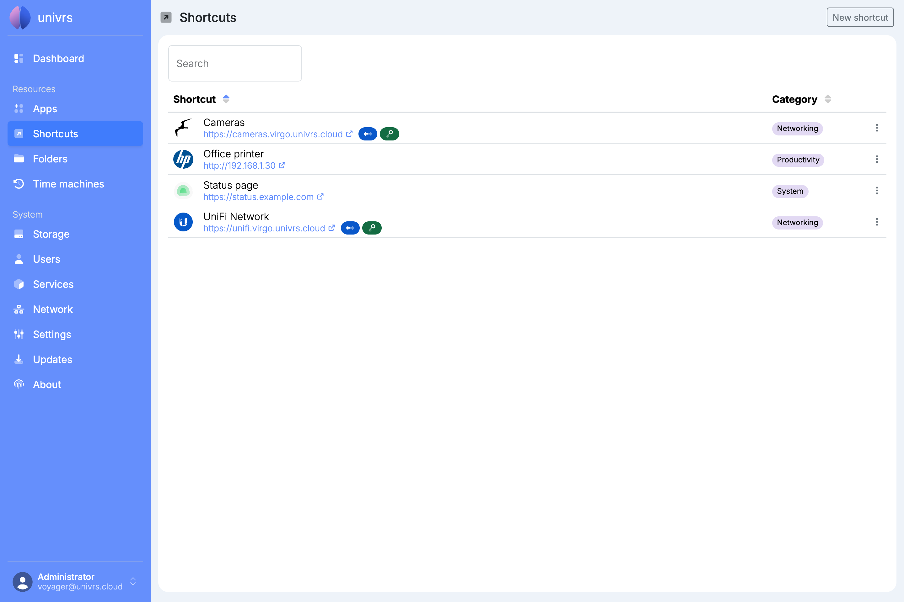
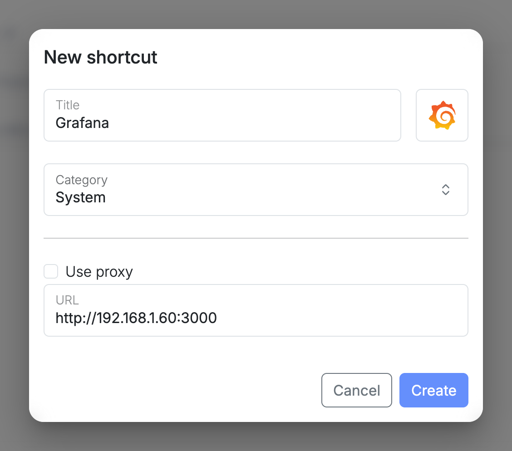
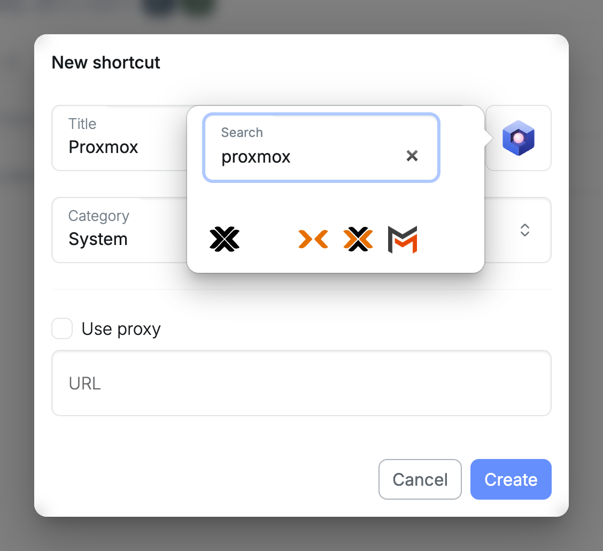
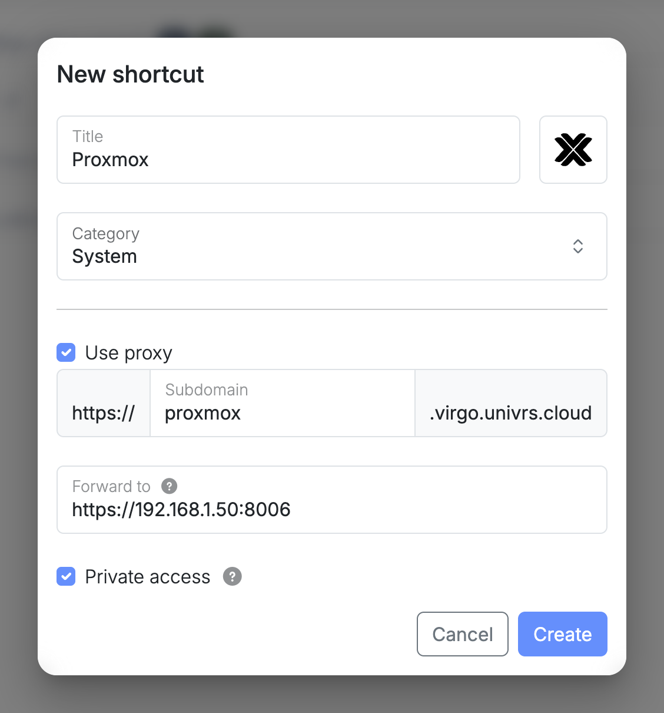
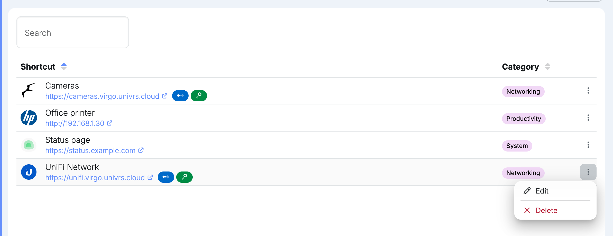
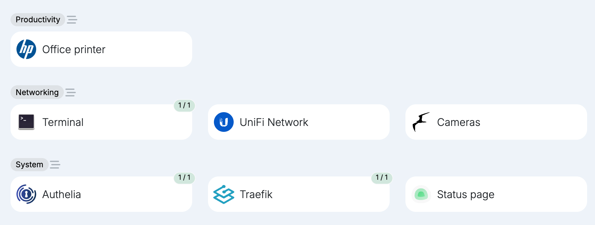

**Shortcuts** are links on the **Dashboard** to things that are not apps on the node, such as a printer, a router or a website. A shortcut can also give a device on your network its own address under the node's domain, reached through the node.

For each shortcut, the list shows its icon, title, address and category. Select an address to open it. Sort the list by title or category with the arrows in the column headers, and use **Search** to find a shortcut by its title, address or category.

## Adding a shortcut

Select **New shortcut**, then enter:

- **Title:** the name shown on the **Dashboard**.
- **Icon:** select the box next to the title and search for an icon by name, then select one.
- **Category:** the group it appears in on the **Dashboard**.
- **URL:** the address the shortcut opens.

## Reaching a device through the node

Select **Use proxy** to open a device on your local network at an address under the node's domain, instead of at its IP address:

- **Subdomain:** the first part of the new address, for example `proxmox` for `https://proxmox.virgo.univrs.cloud`.
- **Forward to:** the device's address on your local network, for example `https://192.168.1.50:8006`.
- **Private access:** only users signed in to the node can open it. Without it, anyone with the link can.

The new address gets a certificate like the node's apps, so browsers trust it even when the device only has a self-signed one.

As with the apps, private access applies from outside your local network. On your local network and over the VPN, the address opens without signing in. See [Authentication](/management/authentication/#on-your-local-network-and-over-the-vpn).

## Editing or deleting a shortcut

Open a shortcut's menu:

- **Edit:** change anything you entered when adding it.
- **Delete:** remove the shortcut. For a shortcut through the node, its address stops working too.

While a change is being applied, a spinning gear takes the place of the menu.

## On the Dashboard

The **Dashboard** shows shortcuts together with the apps, grouped by category.

To change their order, see [Rearranging cards](/management/dashboard/#rearranging-cards).
