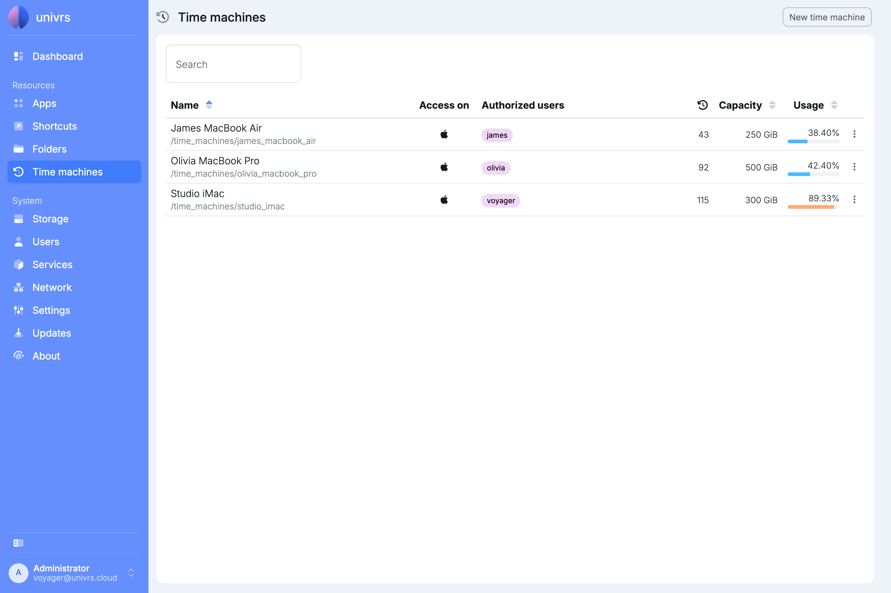
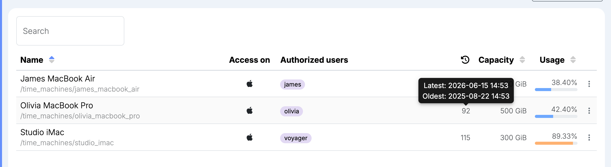
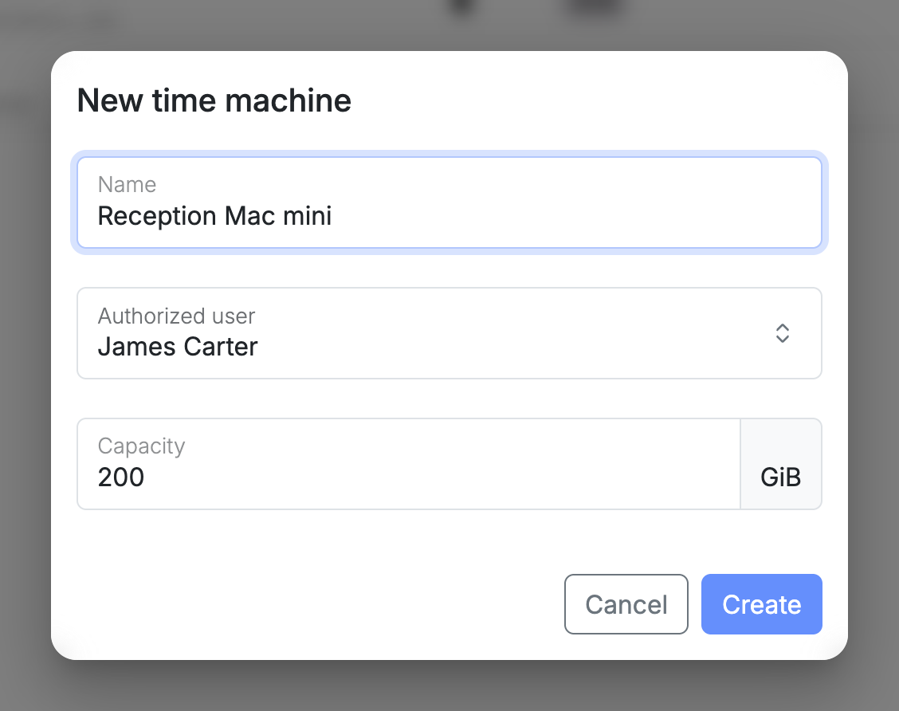
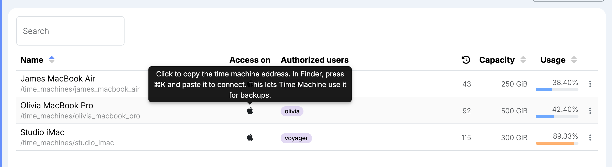
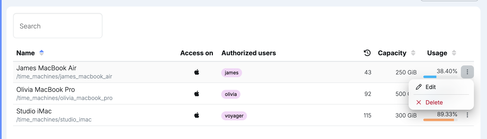
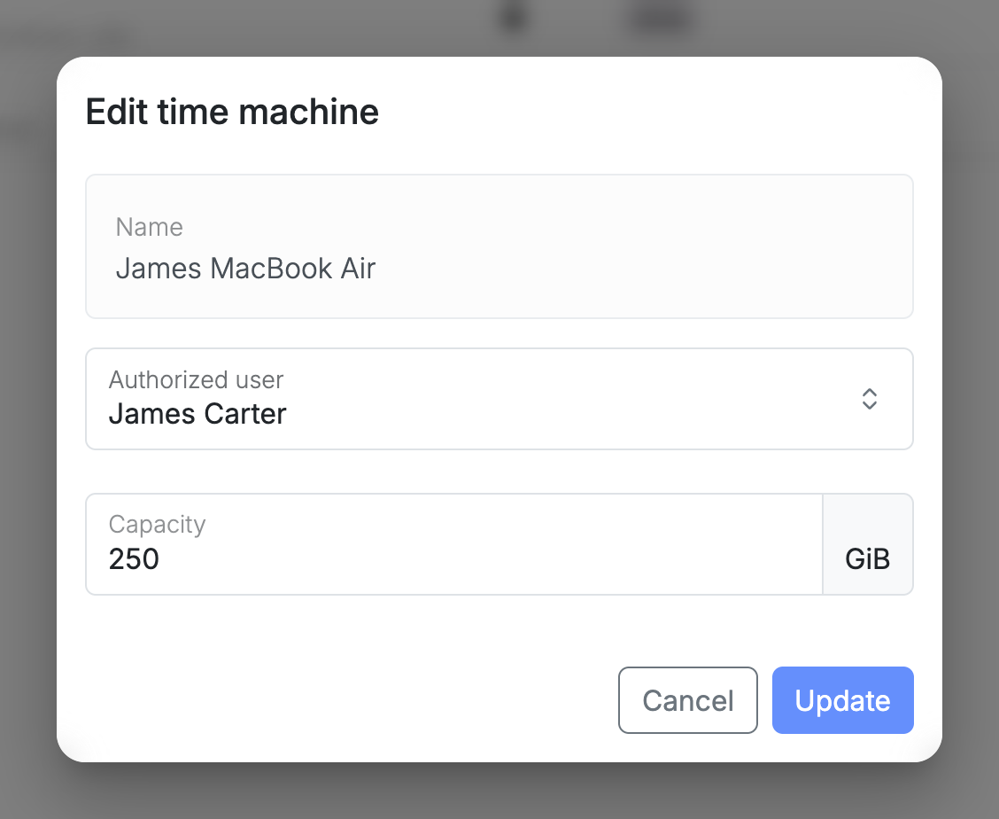

**Time machines** are backup destinations on the node for the Time Machine app on a Mac. Each one has its own space in the storage pool, with a capacity of its own, and one user who can reach it with their node username and password.

For each time machine, the list shows its name, the user who can reach it, how many backups Time Machine has stored in it, its capacity and how much of it is used. Sort the list by name, capacity or usage with the arrows in the column headers, and use **Search** to find a time machine by its name or its user.

Hover over the number of backups to see the latest and the oldest.

## Adding a time machine

Select **New time machine**, then enter:

- **Name:** what the time machine is called, for example after the Mac that backs up to it.
- **Authorized user:** the user whose node username and password the Mac connects with.
- **Capacity:** how much space its backups can take up, in GiB.

## Backing up a Mac

1. On the **Time machines** page, select the Apple icon next to the time machine. This copies its address, for example `smb://olivia@192.168.1.20/time_machine_olivia_macbook_pro`.
2. On the Mac, in Finder, press **⌘K**, paste the address and select **Connect**. When asked, enter the authorized user's node username and password.
3. Open **System Settings**, select **General**, then **Time Machine**. Select **Add Backup Disk**, choose the time machine and follow the steps.

The Mac reaches the node over your local network only, so it backs up while it is on the same network as the node.

Locking the authorized user stops the Mac from backing up, because it can no longer connect. Unlocking them lets it back up again.

## Capacity and history

Time Machine sees the capacity as the size of its backup disk. It keeps hourly backups for the past 24 hours, daily backups for the past month and weekly backups for all previous months. When the time machine is full, it deletes the oldest backups to make room.

Time machines are not part of the pool's [snapshots](/management/system/storage/#usage). Time Machine keeps its own history, the backups counted in the list.

## Editing or deleting a time machine

Open a time machine's menu:

- **Edit:** change the authorized user or the capacity. The name stays the same.
- **Delete:** permanently delete the time machine and every backup in it.

While a change is being applied, a spinning gear takes the place of the menu.

## On the Dashboard

The **Dashboard** lists the time machines too, with a bar showing how full each one is.

