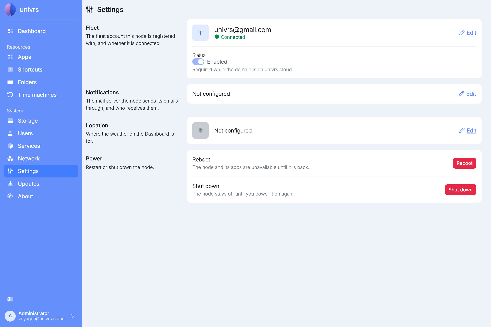
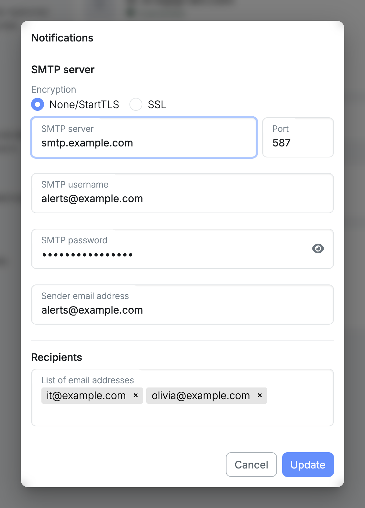
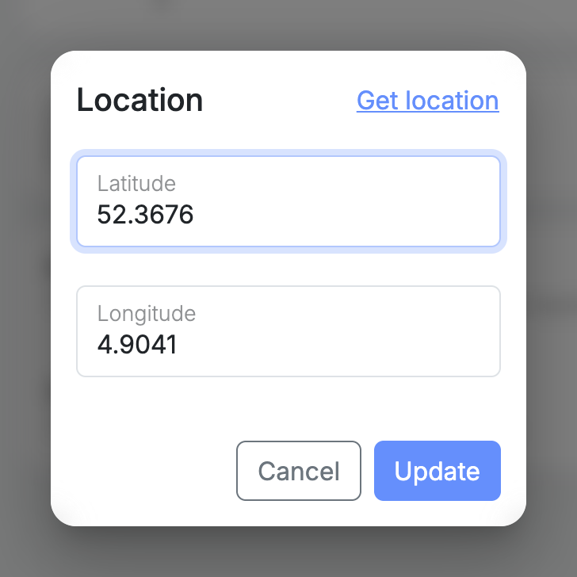
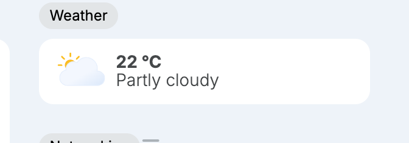
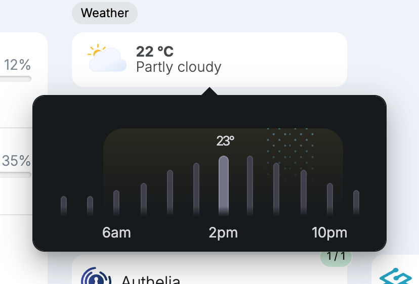
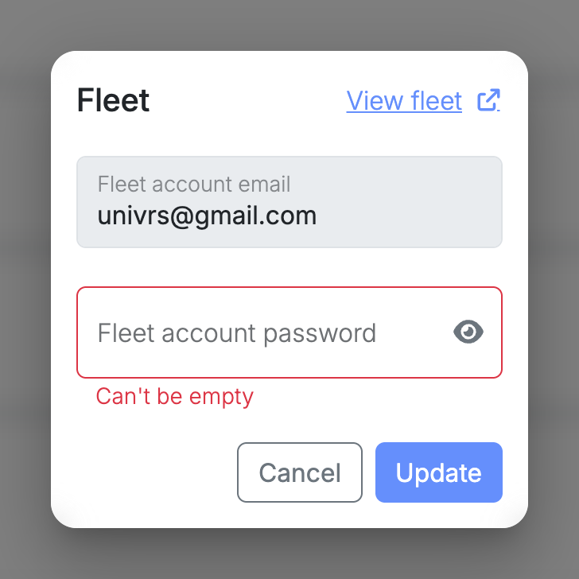
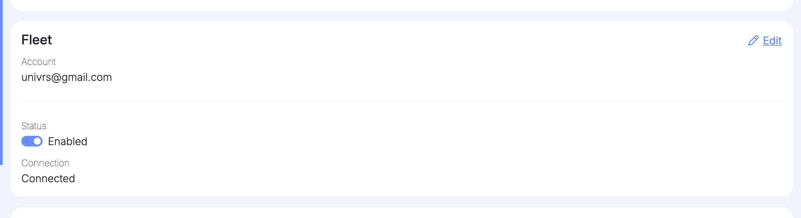
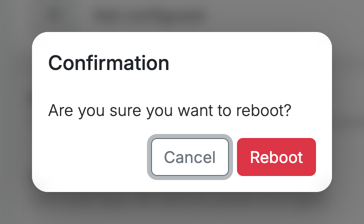
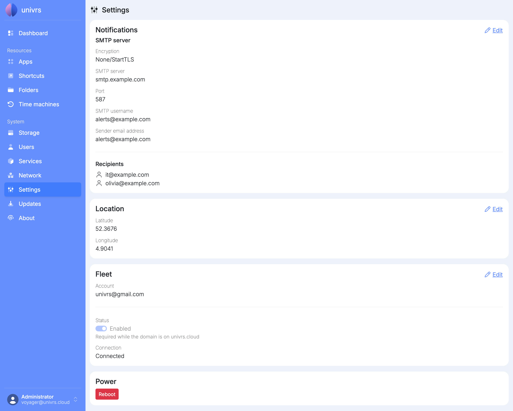

**Settings** holds the node's email notifications, its location, its fleet registration and the reboot button. On a fresh install, **Notifications** and **Location** are not configured yet, **Fleet** shows the registration made during setup, and **Power** lets you reboot the node.

## Notifications

The node emails you about problems with its storage pool and drives, and about what changed when updates are installed. For that it needs an SMTP server to send through. Select **Edit** on the **Notifications** card.

- **Encryption:** **None/StartTLS** for servers that start encryption on the connection, usually on port 587, or **SSL** for servers that expect it from the start, usually on port 465.
- **SMTP server** and **Port:** the address and port of the mail server.
- **SMTP username** and **SMTP password:** the account the node signs in to the mail server with. Leave both empty if the server does not ask for one.
- **Sender email address:** the address the emails come from.
- **Recipients:** the addresses the emails go to. Separate addresses with a comma or a space.

## Location

The location sets where the weather on the **Dashboard** is for. Select **Edit** on the **Location** card, then enter the latitude and longitude, or select **Get location** to use your browser's location.

Once a location is set, the **Dashboard** shows the current weather there, updated every hour.

Select it to see today's temperatures every two hours, with the current time highlighted. The shaded part is daylight, and dotted columns mark hours with a chance of rain.

## Fleet

The **Fleet** card shows the fleet account the node is registered with and whether it is connected. Select **Edit** to register it with a fleet account again, or **Register** if it is not registered yet.

**Status** turns the connection to the fleet on or off. On `univrs.cloud` it cannot be turned off, because the fleet provides the node's DNS record and certificate. On your own domain it can.

If the card says **Registration expired, please re-register.**, select **Edit** and register again.

## Power

**Reboot** restarts the node, after you confirm.

## Everything configured

