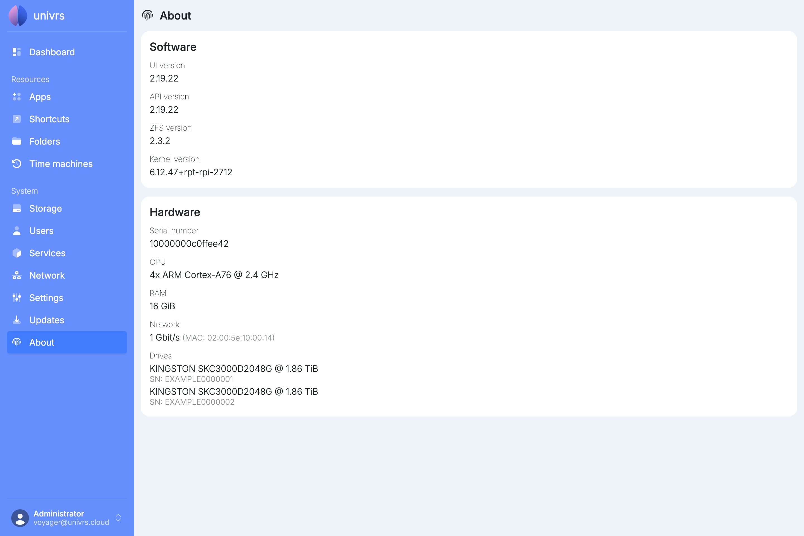

**About** lists the versions of the software on the node and the hardware it runs on. Keep it at hand when you contact support.

## Software

- **UI version:** the version of the node's interface, the pages you are using.
- **API version:** the version of the service behind the interface, which does the work on the node.
- **ZFS version:** the version of ZFS, which runs the [storage pool](/management/system/storage/).
- **Kernel version:** the version of the Linux kernel.

The UI and API versions change with [updates](/management/system/updates/).

## Hardware

- **Serial number:** the node's own serial number.
- **CPU:** how many cores the processor has, the processor itself and its top speed.
- **RAM:** how much memory the node has.
- **Network:** the speed of the node's network connection and its MAC address.
- **Drives:** each drive in the storage pool, with its model, size and serial number.
