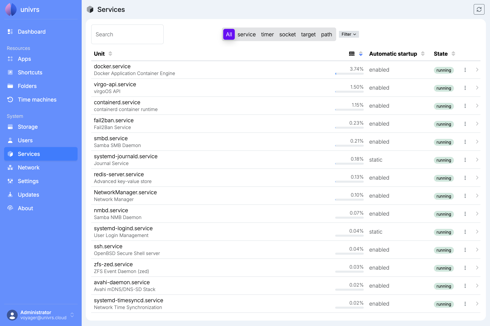
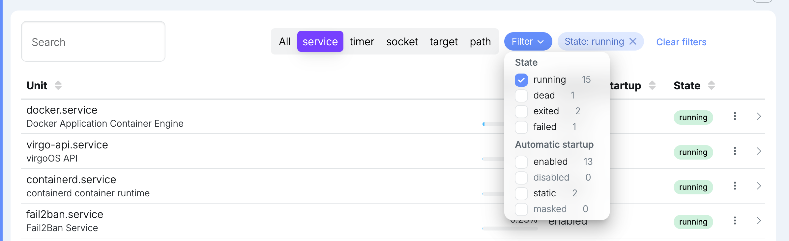
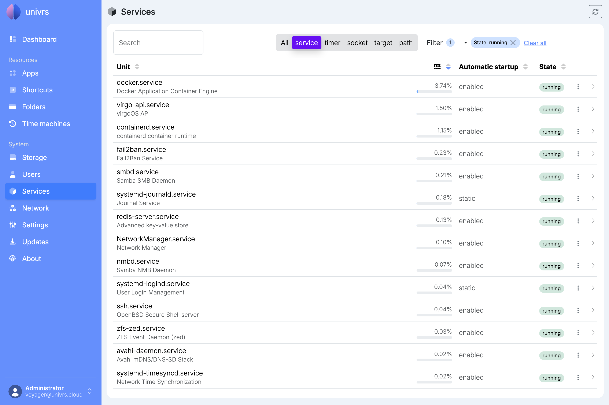
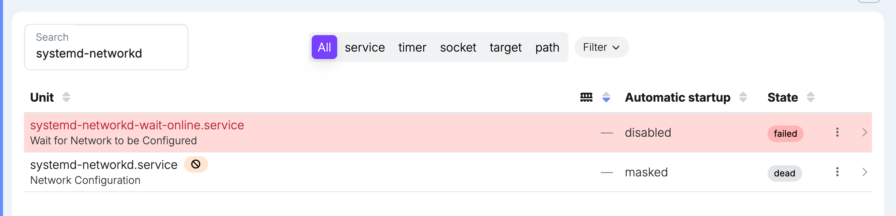
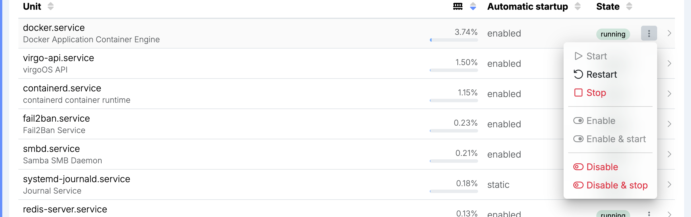
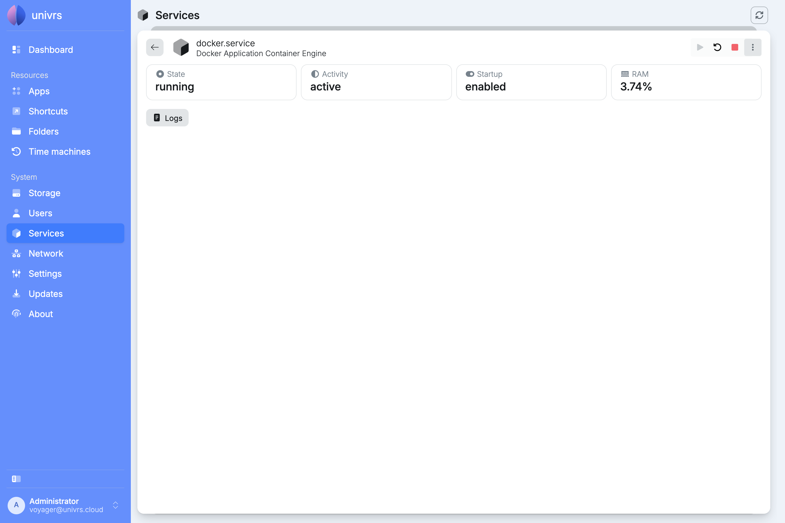
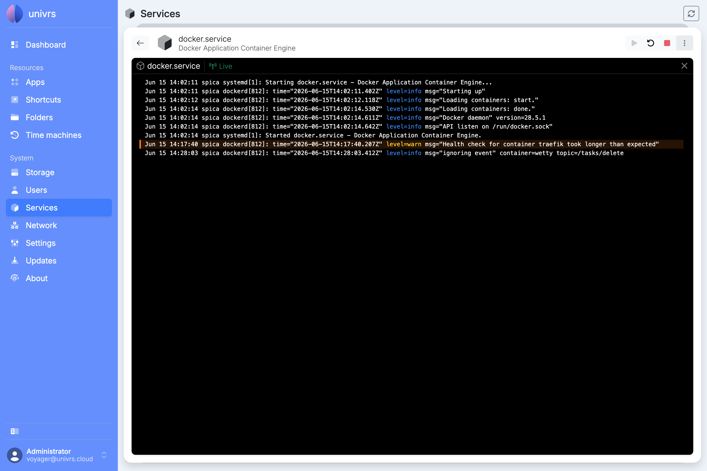

**Services** lists the system services that make up the node, such as Docker, file sharing and the node's own API, together with their timers, sockets and other parts.

Each row shows:

- **Unit:** the name and a short description.
- **RAM:** how much of the node's memory a running service uses. Hover over it for the exact amount.
- **Automatic startup:** whether it starts when the node starts. **enabled** starts it, **disabled** does not, **static** means it only starts when something else needs it, and **masked** means it is blocked and cannot be started at all.
- **State:** what it is doing right now, such as **running**, **exited**, **waiting**, **listening** or **failed**.

The list is not live. It is read when the node starts and again after each action you take on this page, so a service that stops, fails or changes its memory use on its own is not shown until you select the reload button in the top right corner.

## Finding a service

Type in **Search** to find services by name or description. The buttons next to it show only one kind at a time: **service**, **timer**, **socket**, **target** or **path**. **Filter** narrows the list by state and automatic startup, with the number of matches next to each choice.

Each active filter appears as a pill; remove it with its **×**, or select **Clear all**.

## Services that need attention

A service that failed is shown in red. A masked service is marked with a crossed-out circle, and one that could not be found or loaded with a warning sign.

## What you can do with a service

| Action | What it does |
| --- | --- |
| Start | Starts a service that is not running. |
| Restart | Stops a running service and starts it again, for example to pick up a change. |
| Stop | Stops a running service until it is started again, or until the node restarts if it is enabled. |
| Enable | Makes the service start every time the node starts, without starting it now. |
| Enable & start | Enables the service and starts it right away. |
| Disable | Stops the service from starting when the node starts. A service that is running keeps running. |
| Disable & stop | Disables the service and stops it right away. |

Actions that do not apply are greyed out: a service that is already running cannot be started, a **static** service cannot be enabled or disabled, a **masked** one cannot be started or enabled, and a target cannot be started or stopped. **Restart**, **Stop**, **Disable** and **Disable & stop** ask you to confirm first, because they interrupt the service or change what happens when the node starts.

While an action runs, a spinning gear replaces the service's menu.

## From the list

Every action is in the service's menu, the **⋮** at the end of its row.

## From the details

Select a service to open its details: its state, activity, automatic startup and memory use. **Start**, **Restart** and **Stop** are the buttons at the top right, and the **⋮** next to them holds **Enable**, **Enable & start**, **Disable** and **Disable & stop**. The arrow in the top left goes back to the list.

## Logs

Select **Logs** in the details to open the service's log. It starts with the last 200 lines and updates live, adding each new line to the view as the service writes it. If the connection drops, it says **Disconnected**; select **Connect** to pick up again. Close the log with the **×**.

