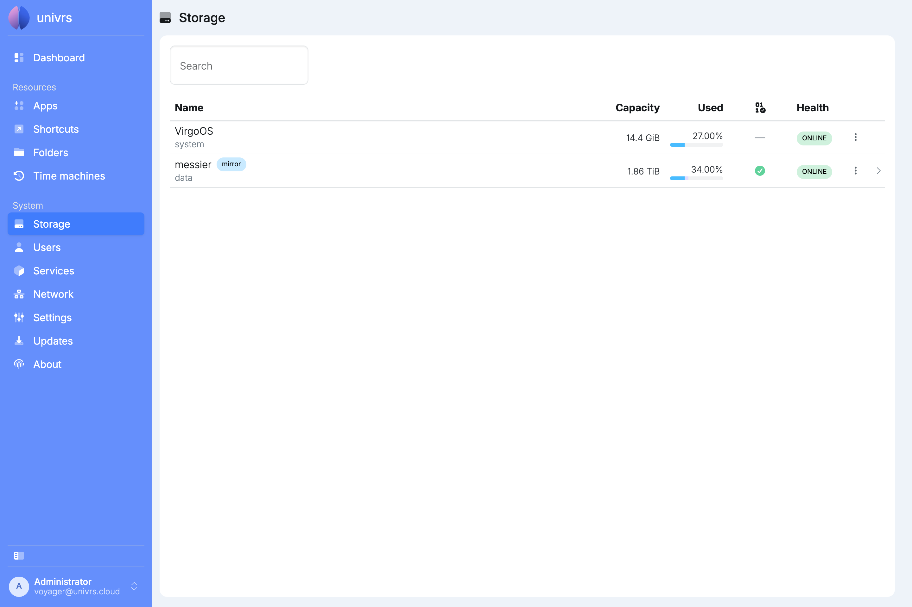
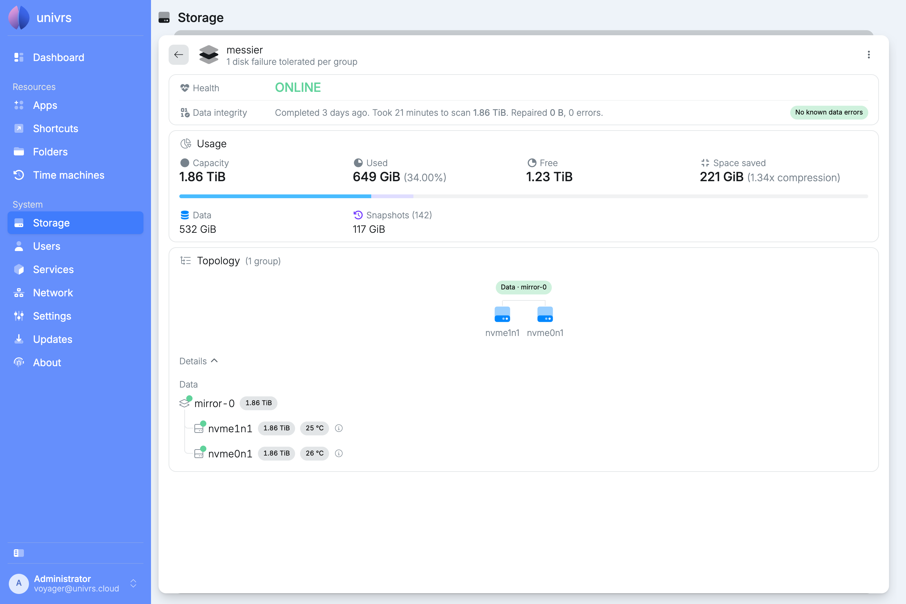
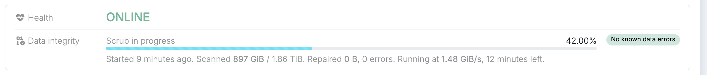
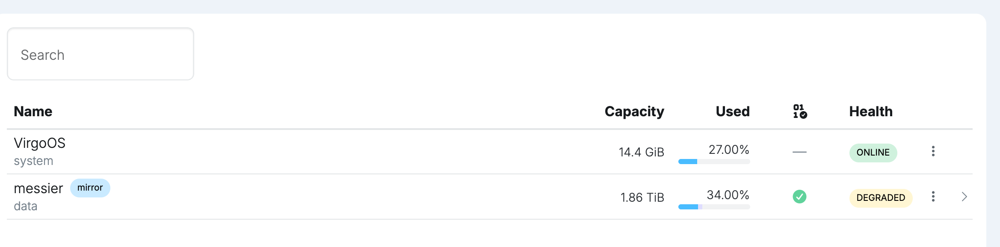
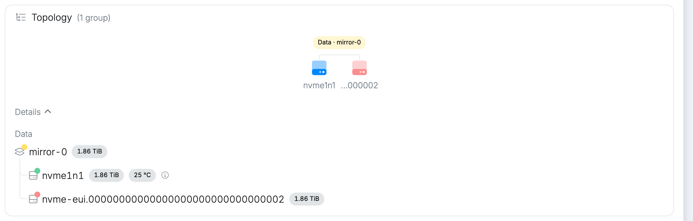
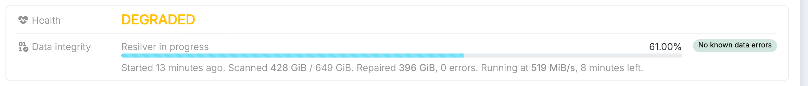
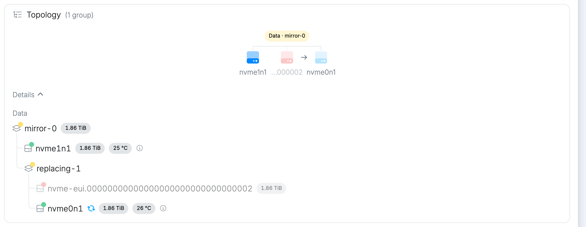

**Storage** shows where the node keeps everything: the drive the system runs from, and the storage pool created during [setup](/setup/storage/) that holds your apps, their data and your folders.



- **VirgoOS** is the system drive. It only holds the operating system.
- **messier** is the pool, with its layout next to its name, here **mirror**.

For each, the list shows the capacity, how much of it is used, how much the pool's snapshots take up, the result of the last data integrity check, and the health.

## The pool

Select the pool to see it in detail. Under its name is how many drives can fail in each group without losing data.



### Health

- **ONLINE:** every drive is working.
- **DEGRADED:** a drive is missing or failing. The pool still works and your data is still there, but it can no longer survive another drive failing.
- **FAULTED** or **UNAVAIL:** the pool cannot be used.

A warning sign next to the pool's name means one of its drives reports a problem in its own health check. Hover over it to see which drive and what it reports.

### Data integrity

The pool keeps a checksum of everything it stores. A **scrub** reads all of it back and checks it against those checksums, repairing anything that does not match from the pool's redundancy. The card shows the last scrub, or the one running now with its progress.



The node scrubs the pool by itself on the second Sunday of every month, shortly after midnight. Only a healthy pool is scrubbed: while it is **DEGRADED**, the monthly scrub is skipped until the pool is repaired.

**No known data errors** means every block checked out.

### Usage

**Capacity**, **Used** and **Free** are the pool's space. **Compression** shows how much smaller the data is on disk than it really is, and how much space that saves.

The bar splits the used space into your **Data** and the **Snapshots**. Snapshots are the pool's automatic history of apps, their data and folders. The node keeps one for each of the last 36 hours, 30 days, 60 months and 5 years, and removes older ones by itself. They take space only for what has changed since they were made.

### Topology

The topology shows how the drives are grouped, here two drives mirroring each other. Select **Details** to list every group and drive with its size, temperature and state. A drive's temperature turns yellow or red when it gets too warm, errors appear next to it in red, and the **ⓘ** shows its model, serial number and ID.

## Email reports

When [notifications](/management/system/settings/#notifications) are set up, the node emails the recipients:

- when a scrub finishes, with the pool's full status, even when everything is fine;
- when a resilver finishes;
- when a drive fails, is removed or becomes unavailable.

## When a drive is missing

If a drive fails or is removed, the pool shows **DEGRADED**.



In the topology, the missing drive is shown in red, under its ID instead of its name.



The pool keeps working from the remaining drive, but until the missing one is back or replaced, another failure would lose data.

## Replacing a drive

Replacing a drive from the **Storage** page is coming soon. Until then, it is standard ZFS. Fit a new drive at least as large as the one it replaces, then replace the old drive's ID with the new drive's in the pool:

```sh
zpool replace messier <old drive ID> <new drive ID>
```

The ID of the missing drive is the one shown in the topology.

## Resilvering

As soon as the new drive is in the pool, ZFS copies the pool's data onto it. This is a **resilver**. It shows in **Data integrity** with its progress and how long it has left, and the pool stays **DEGRADED** until it finishes.



In the topology, the old drive and the new one appear side by side, with an arrow from the old one to the new one, and the new one shows a spinning icon while it is being filled.



Only the data actually stored is copied, so a resilver takes as long as it takes to copy what the pool holds, not the whole drive. When it finishes, the old drive disappears from the topology and the pool is **ONLINE** again.
