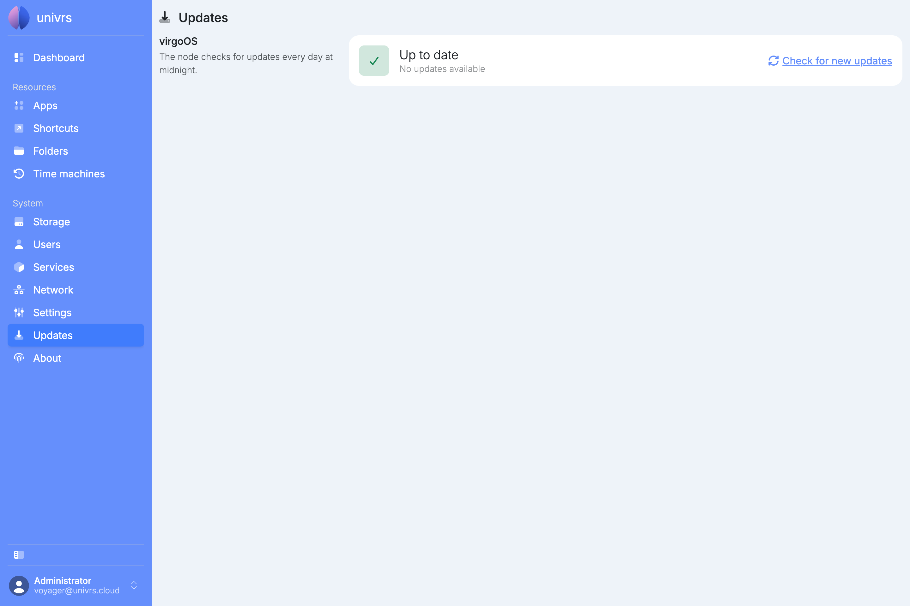
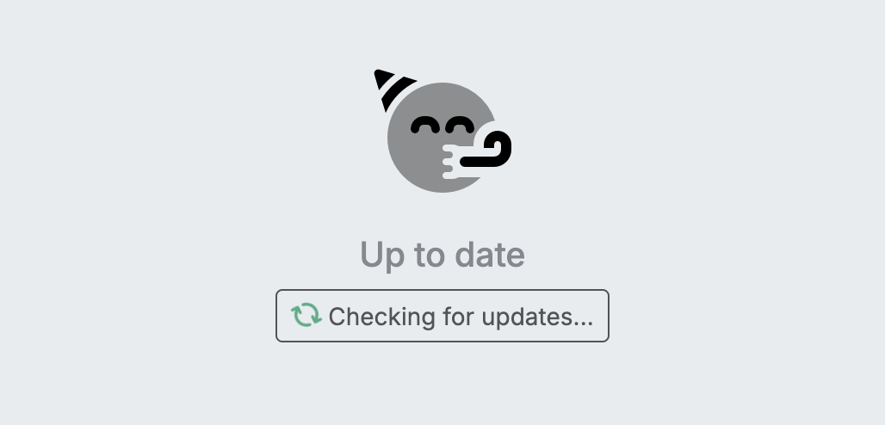
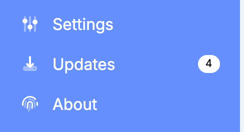
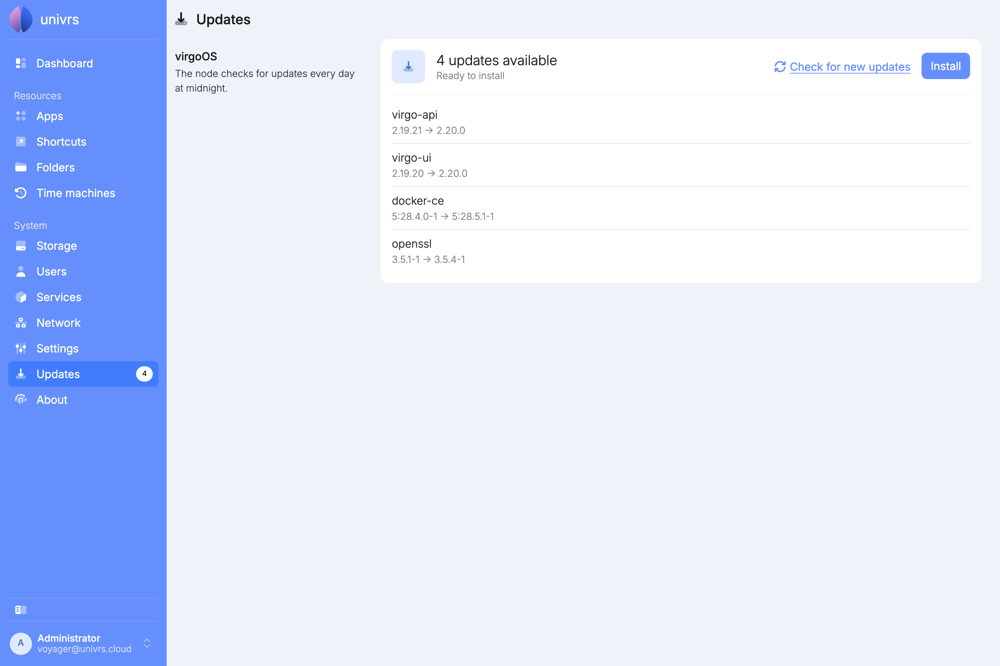
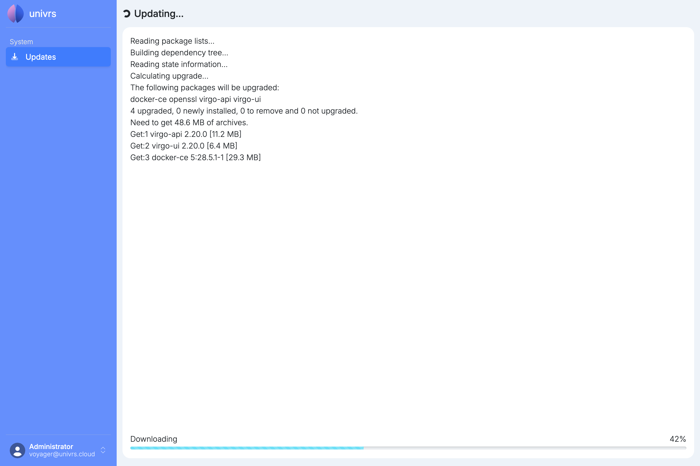
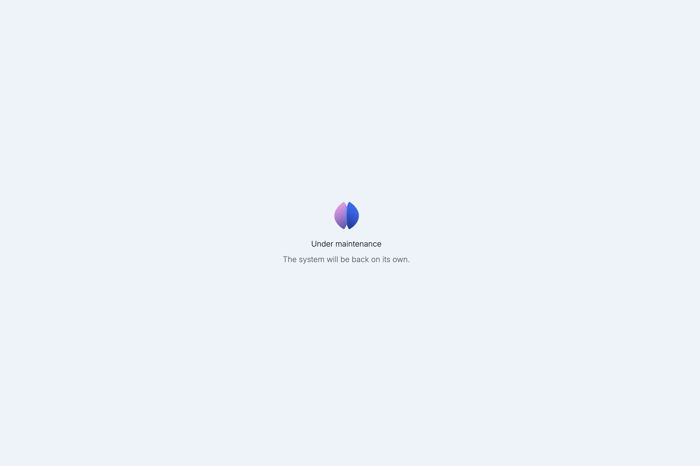
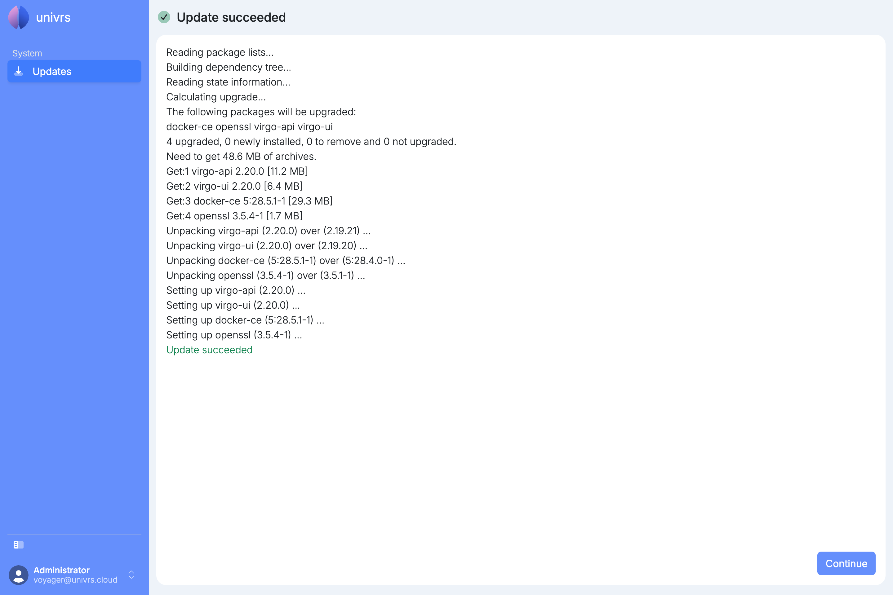
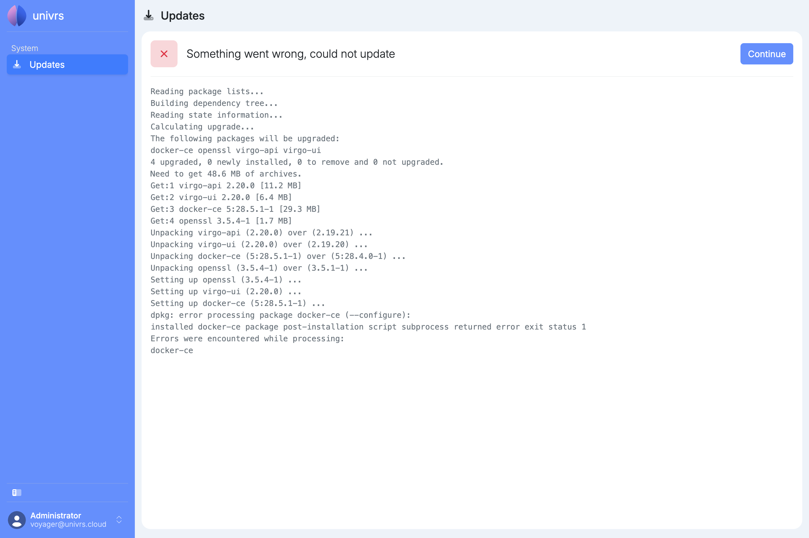

**Updates** shows whether new versions of virgoOS are available and installs them.

## Up to date

The node checks for updates every day at midnight. When there is nothing to install, the page says **Up to date**.

Select **Check for new updates** to check right away instead of waiting for the daily check.

## When updates are available

When updates are available, **Updates** in the menu shows how many there are, so you see it from any page.

The Updates page lists each update with the version installed now and the version it updates to.

Select **Install** to install all of them. **Install** is not available while the node is checking for updates or while an app is being updated.

## While an update runs

The update shows each step as it happens, with the progress of the download and then of the installation. The node's other pages stay closed until the update is finished and you continue.

Everyone else who opens the node in the meantime, including users without the administrator role, sees that it is under maintenance and will be back on its own.

## When it finishes

When the update succeeds, select **Continue** to go back to the **Dashboard**.

If the update needs a restart to take effect, **Reboot** appears instead of **Continue**, and the node restarts to finish the update.

## If the update fails

If something goes wrong, for example a package fails to set up, the page says the update could not be completed and shows the steps up to the error. Select **Continue** to go back to the **Dashboard**, then install the updates again later.

