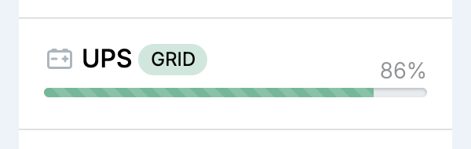
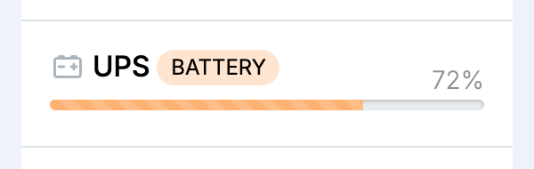

A UPS (uninterruptible power supply) keeps the node running from a battery when the power goes out. virgoOS watches it, shows its state on the [Dashboard](/management/dashboard/#status), and shuts the node down cleanly before the battery runs out. There is nothing to configure.

## Which UPS the node uses

- **Built-in:** a node that has its own UPS inside uses that one.
- **USB:** a node without a built-in UPS uses a UPS connected to one of its USB ports. It has to be a USB HID model. Plug it in at any time: it is picked up on its own, with no restart. Unplug it, and the node goes back to having no UPS.

A USB UPS only helps when the node's power cable is plugged into one of its battery-backed outlets.

## On the Dashboard

The **UPS** row of the **Status** column shows where the node's power comes from and how charged the battery is.

- **GRID**, in green: the node runs from the wall socket. The bar shows the battery's charge, and moves while the battery is charging.
- **BATTERY**, in orange: the power is out and the node runs from the battery. The bar turns orange and shows what is left.

- **not found**, in red: the node has no UPS. It works as usual, but a power cut turns it off on the spot.

- **can't connect:** the service that watches the UPS is not answering. Check on [Services](/management/system/services/) that **virgo-ups** is running.

- Any other message, in orange: the UPS answered, but its reading could not be used. The message says why.

A built-in UPS that supports it is not kept at 100%. Charging stops above 97% and starts again below 90%, so a charge anywhere in between with the node on grid power is normal.

## During a power cut

1. The node switches to the battery and the **Dashboard** shows **BATTERY**. Everything keeps working.
2. If the power comes back, the **Dashboard** shows **GRID** again and the battery recharges.
3. If it does not, the node shuts down once the battery is down to 50%. It is an ordinary, orderly shutdown, so nothing is cut off mid-write.

The 50% level is fixed.

A built-in UPS is checked once more a few seconds before the shutdown, so power that returns at the last moment cancels it. After the node has shut down, the built-in UPS turns itself off too, which keeps what is left of the battery.

On a node with a built-in UPS, the **virgo-ups** service's [log](/management/system/services/#logs) records each switch between grid and battery, and the shutdown when it starts one.
