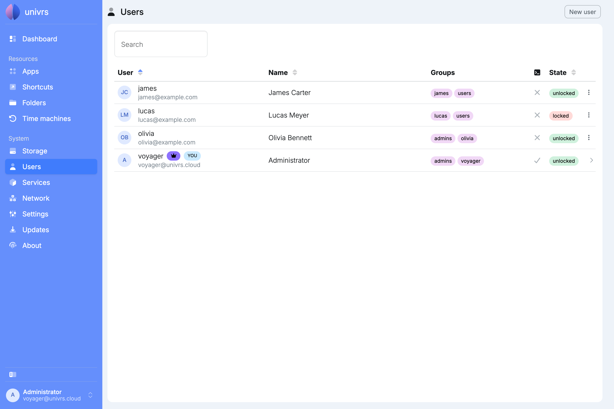
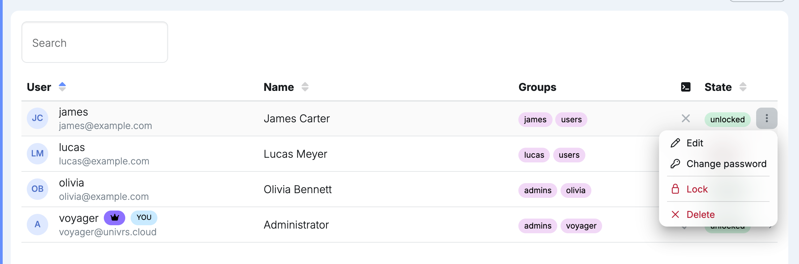
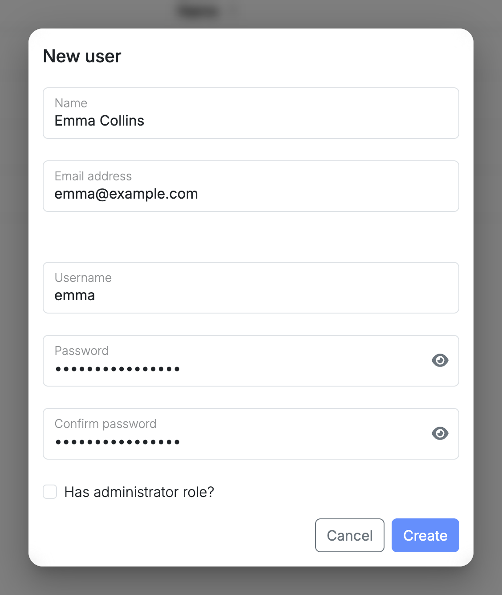

A user of the node signs in to the node itself, and uses the same username and password to reach folders and Time Machine backups. Apps keep their own users, separate from these.

## Roles

| Role | What they can do |
| --- | --- |
| Owner | The account whose password was set during setup. An administrator who cannot be locked or deleted, and whose profile and password only they can change. |
| Administrator | Every page in the menu, including managing users. |
| User | Sign in to the node, reach the folders and Time Machine backups they have access to, and manage their own [profile](/management/profile/). |

Only the owner can give a user the administrator role.

## Managing users

**Users** lists everyone who can sign in to the node. Only administrators see it in the menu. The owner is marked with a crown, and your own account with **YOU**.

Open a user's menu to manage them:

- **Edit:** change the user's name and email address. The owner can also change their role.
- **Change password:** set a new password for the user.
- **Lock:** stop the user from signing in, without deleting them. **Unlock** lets them sign in again.
- **Delete:** remove the user.

Your own account has no menu here; it links to your [profile](/management/profile/) instead.

## Adding a user

Select **New user**, then enter a name, email address, username and password. The owner can also tick **Has administrator role?**.

