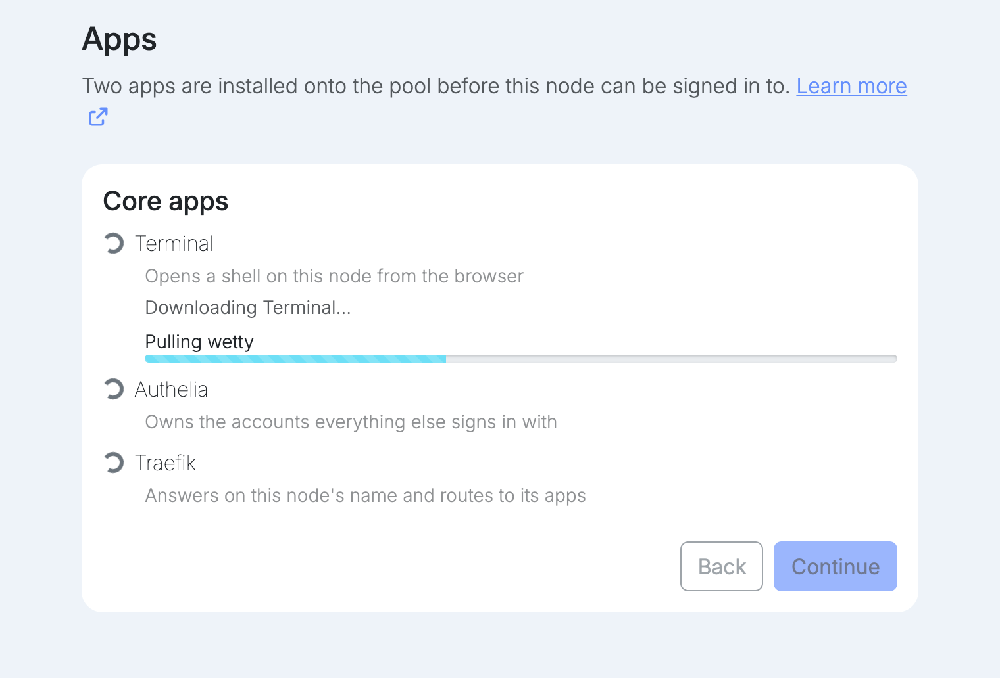
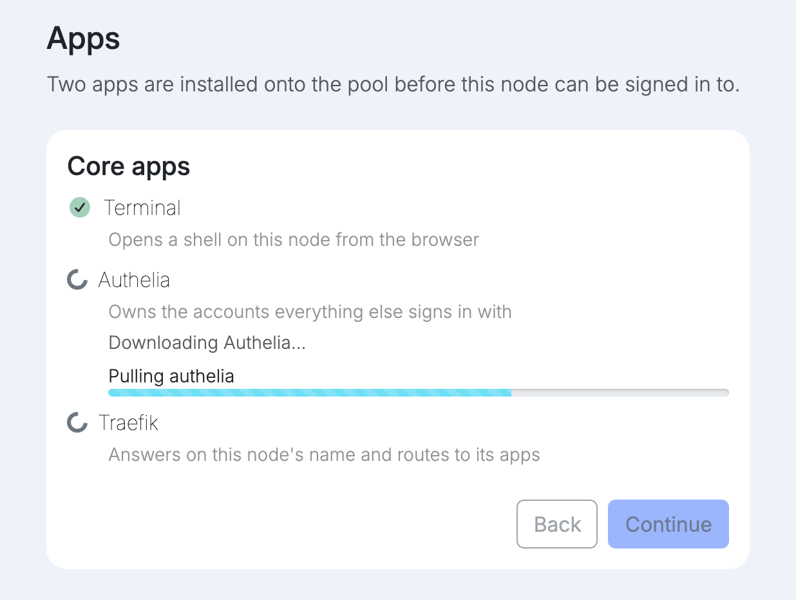
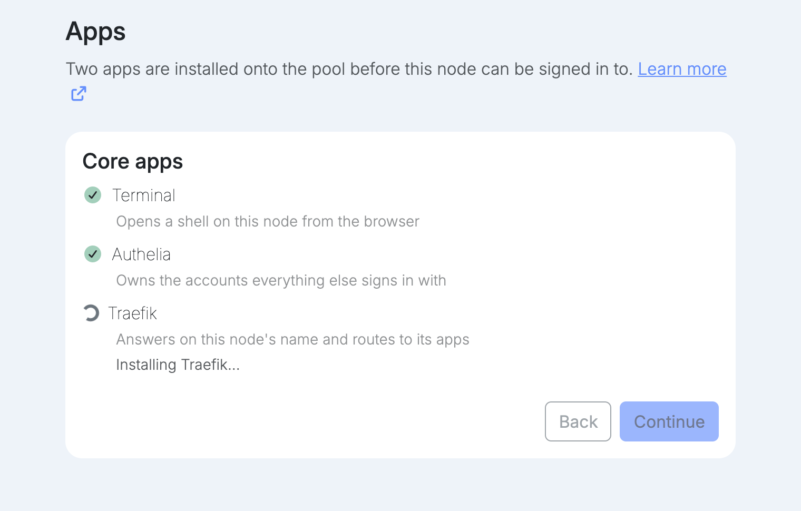
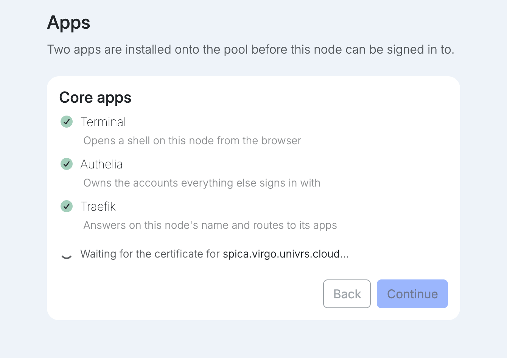
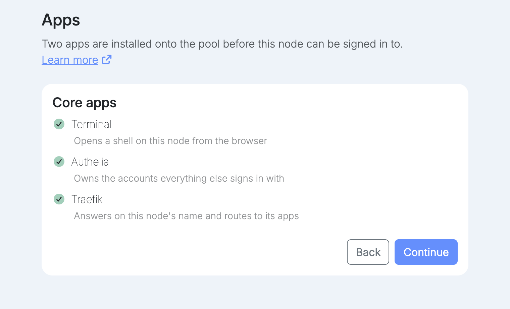
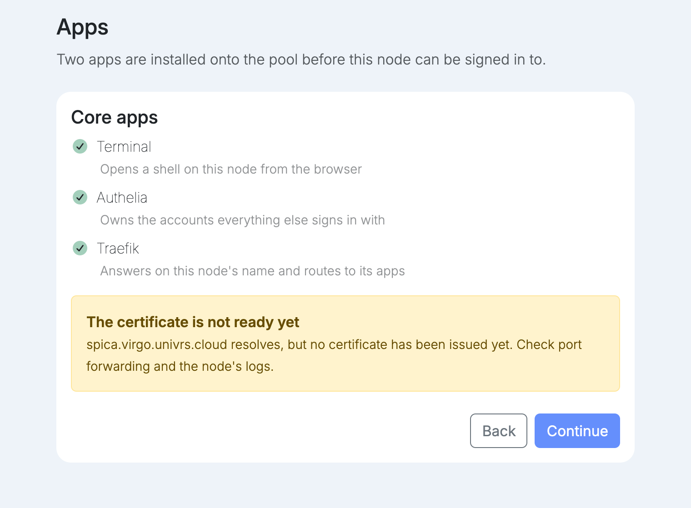

The node installs its core apps onto the pool by itself, one at a time:

- **Terminal** opens a shell on the node from the browser.
- **Authelia** owns the accounts everything else signs in with.
- **Traefik** answers on the node's name and routes to its apps.

Each app is downloaded and then installed. The app being worked on shows what it is doing, and the ones after it wait their turn.

## Certificate

Once all three are running, setup waits for the node's certificate.

<Tabs syncKey="domain">
<TabItem label="Your own domain">

Let's Encrypt issues the certificate once it can reach the node on TCP 80 at its name. The name has to resolve on the internet to your public IP address, and TCP 80 has to be forwarded to the node.

</TabItem>
<TabItem label="univrs.cloud">

The node gets a wildcard certificate from Let's Encrypt through its fleet registration: the fleet answers Let's Encrypt's DNS check, so nothing on your network has to be reachable from the internet for it.

</TabItem>
</Tabs>

### Waiting

While the certificate is being issued, **Back** and **Continue** are locked.

### Issued

When the certificate is issued, the waiting line disappears and **Continue** becomes available.

### Not ready after a minute

If the certificate is still missing after a minute, setup explains why and lets you continue anyway:

- **The name does not resolve yet.** DNS may still be propagating, or the record was not created.
- **The name resolves but no certificate was issued.** Check the port forwarding and the node's logs.

If an app fails to install, setup cannot continue until it is installed and running.
