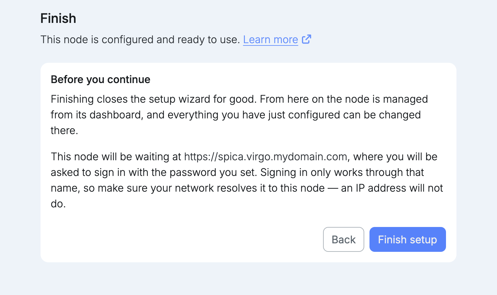

import { Tabs, TabItem } from '@astrojs/starlight/components';

**Finish setup** ends setup for good. The browser then opens the node at its name, where you sign in with the username and the password you just set. Everything configured during setup can be changed later, once you are signed in.

Signing in only works through that name, not through an IP address.

<Tabs syncKey="domain">
<TabItem label="Your own domain">

The node opens at `https://spica.virgo.mydomain.com`. Make sure the DNS records from the [network host](/setup/host/) step are in place, so your network resolves the name to the node.

</TabItem>
<TabItem label="univrs.cloud">

The node opens at `https://spica.virgo.univrs.cloud`. Its DNS record is managed by the fleet, so the name already resolves.

</TabItem>
</Tabs>
