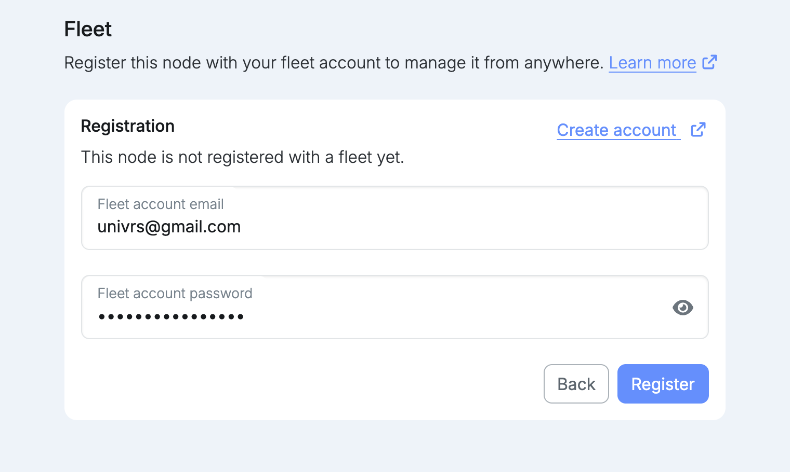
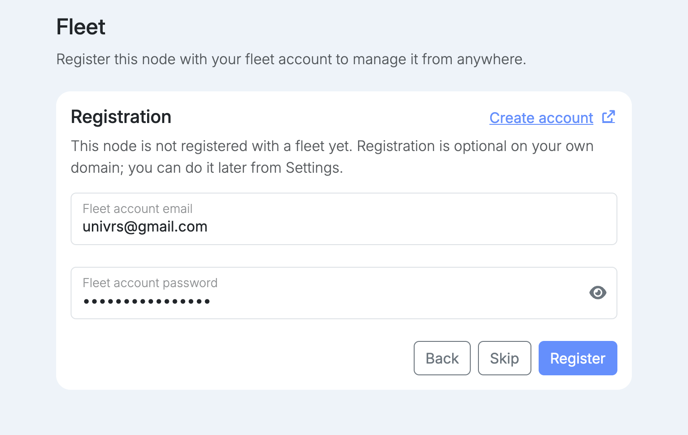
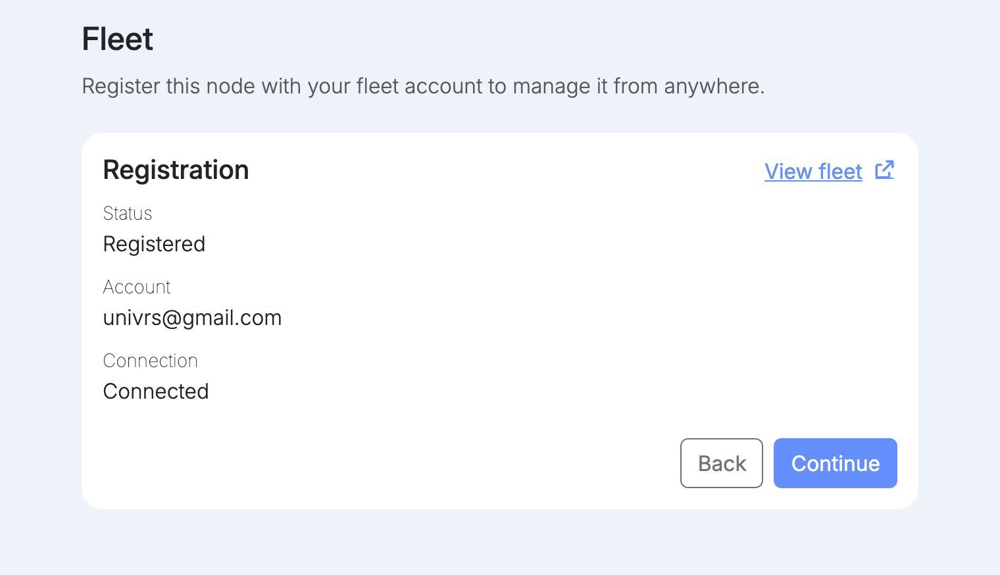

import { Tabs, TabItem } from '@astrojs/starlight/components';

Registering connects the node to your fleet account, so you can manage it from anywhere. The node connects out to the fleet itself, so this works even behind CGNAT, without a public IP address or any [forwarded ports](/setup/ports/). Enter your fleet account email and password, then select **Register**. If you have no account yet, use **Create account**.

Registration is mandatory when the node uses the `univrs.cloud` domain, and optional when it uses your own domain.

<Tabs syncKey="domain">
<TabItem label="univrs.cloud">

Registration is required, because the fleet provides the node's DNS record and its wildcard certificate. There is no **Skip**.

</TabItem>
<TabItem label="Your own domain">

Registration is optional. Select **Skip** to continue without it, and register later from Settings.

</TabItem>
</Tabs>

Once registered, the step shows the account and the connection state. Continuing from here, or skipping, starts installing the core apps.
