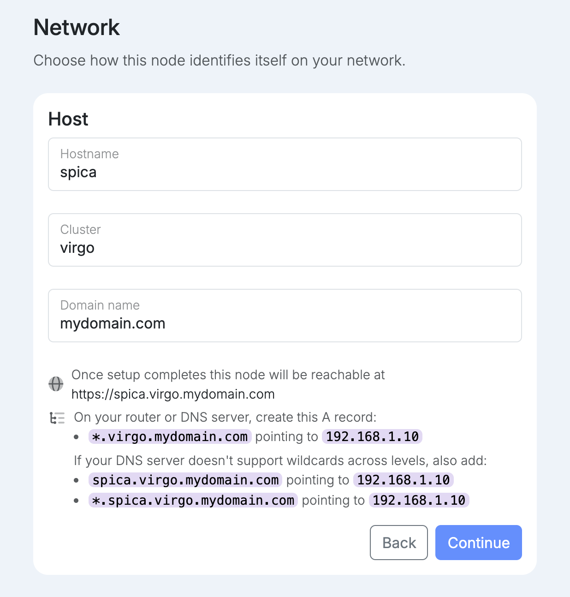
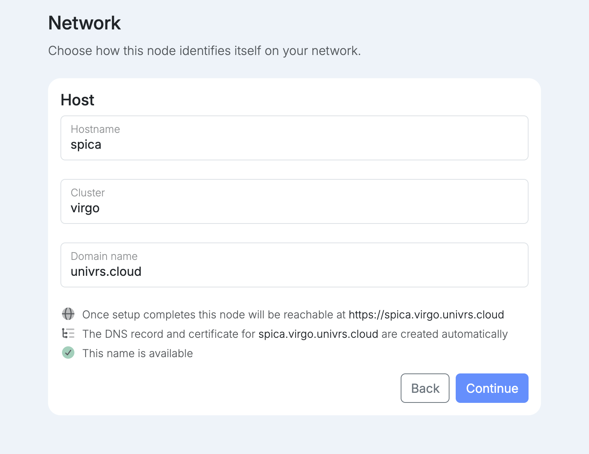

This sets the name the node answers to: `https://<hostname>.<cluster>.<domain>`.

- **Hostname** is the node's own name.
- **Cluster** groups the nodes that share a virtual IP.
- **Domain name** is either `univrs.cloud` or a domain you own. With `univrs.cloud`, registering the node with your fleet is mandatory; with your own domain it is optional.

What happens next depends on the domain.

<Tabs syncKey="domain">
<TabItem label="Your own domain">

With your own domain, for example `spica.virgo.mydomain.com`, you create the DNS records yourself. Setup lists them: a wildcard `*.virgo.mydomain.com` pointing to the virtual IP, on your router or DNS server. If your DNS server does not support wildcards across several levels, also add the two extra records it lists.

:::tip
If your domain has no DNS hosting yet, you can host it with [Cloudflare](https://www.cloudflare.com/); the free plan is enough. Create the records in the Cloudflare dashboard and set them to **DNS only**, not proxied: Cloudflare's proxy only carries web traffic, and the node also serves email, VPN and video calls.
:::

</TabItem>
<TabItem label="univrs.cloud">

With `univrs.cloud`, for example `spica.virgo.univrs.cloud`, the DNS record and the certificate are created for you through your fleet account. There is nothing to set up on your router's DNS.

Setup checks that the cluster name is still free, and you can only continue once it shows **This name is available**.

</TabItem>
</Tabs>

If another node on the network already belongs to a cluster, the cluster and domain are locked to that cluster.
