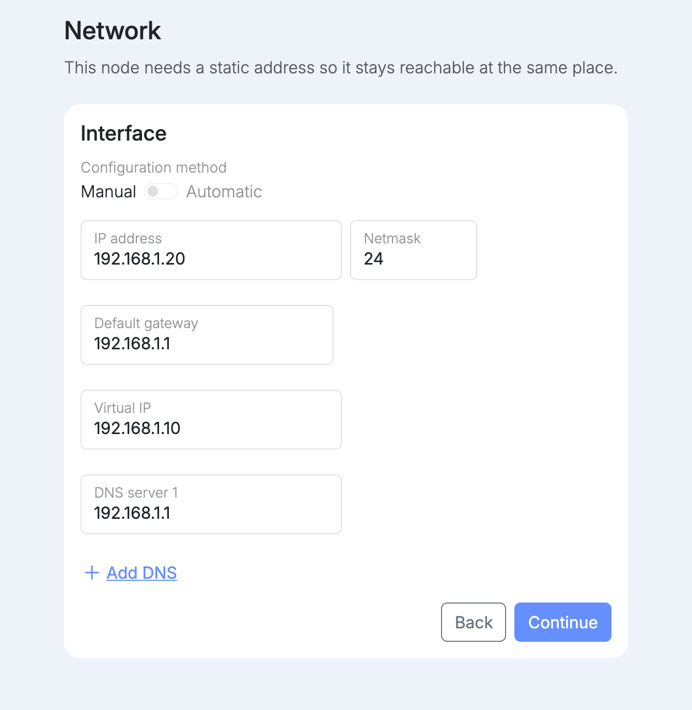

The node needs a static address so it can always be found at the same place. The fields start with the address the node currently has.

| Field | What to enter |
| --- | --- |
| IP address | The node's own fixed address on your network, for example `192.168.1.20`. This is the address you open setup on. |
| Netmask | The prefix length. `24` is the most common. |
| Default gateway | Your router's address. |
| Virtual IP | The cluster's shared address, for example `192.168.1.10`. |
| DNS server | Up to three servers. Use **Add DNS** to add more. |

The node's name and all of its apps point to the virtual IP, not to the node's own address. It is also the address your router forwards traffic to, so a node can be replaced without changing DNS or the router. Without a virtual IP, they point to the node's own address instead. The virtual IP is required when this is the only node on the network. If another node on the network already has one, the field is locked to that address, and this node can join it from the dashboard once setup is finished.

:::note
If you opened setup by the IP address you are changing, the connection to the node drops. After a few seconds setup opens again at the new address. Your browser may show the certificate warning once more.
:::
