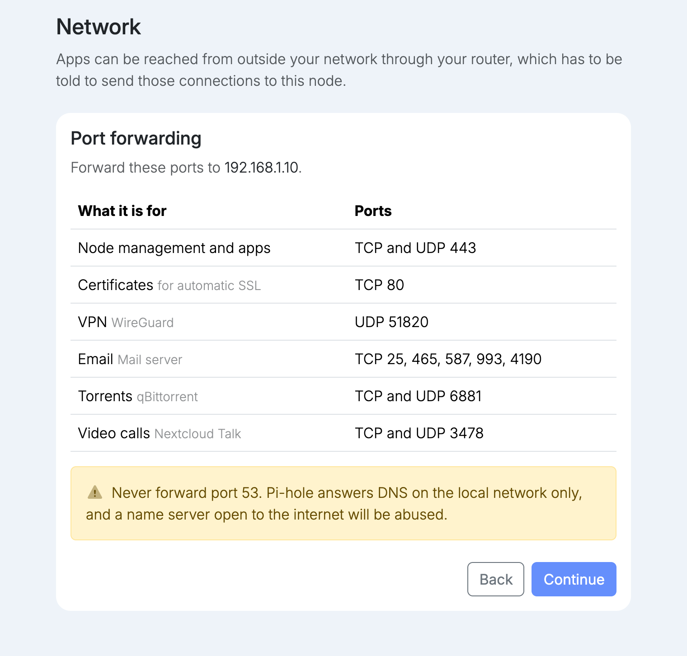

import { Tabs, TabItem } from '@astrojs/starlight/components';

To reach the node and its apps from outside your network, forward these ports on your router to the address shown, which is the virtual IP:

| What it is for | Ports |
| --- | --- |
| Node management and apps | TCP and UDP 443 |
| Certificates | TCP 80 |
| VPN (WireGuard) | UDP 51820 |
| Email | TCP 25, 465, 587, 993, 4190 |
| Torrents (qBittorrent) | TCP and UDP 6881 |
| Video calls (Nextcloud Talk) | TCP and UDP 3478 |

Forwarding is what makes the node reachable from the internet. Without it, node management, apps and the VPN only work from inside your network.

:::caution[You need a public IP address]
Forwarding only works if your internet connection has its own public IP address. Some providers share one public address between many customers, which is called carrier-grade NAT (CGNAT). Behind CGNAT, forwarding on your router has no effect, and nothing on the node can be reached from the internet.

To check, compare the WAN address shown on your router with the address a site such as [whatismyip.com](https://www.whatismyip.com/) reports. If they differ, or the router's address starts with `100.64` to `100.127`, you are behind CGNAT. Ask your provider for a public IP address.
:::

:::tip[Manage remotely without forwarding]
Behind CGNAT, without a public IP address, or without any forwarded ports, you can still manage your nodes from anywhere through your fleet at [fleet.univrs.cloud](https://fleet.univrs.cloud). The node connects out to the fleet itself, so nothing has to reach it from the internet. This covers managing the nodes; apps and the VPN still need forwarded ports to be reached from outside.
:::

### Certificates without forwarding

<Tabs syncKey="domain">
<TabItem label="Your own domain">

The node falls back to a self-signed certificate, and browsers warn about it. A valid certificate is issued by Let's Encrypt over TCP 80, so that port has to be forwarded, and the node's name has to resolve on the internet to your public IP address so Let's Encrypt can reach it.

</TabItem>
<TabItem label="univrs.cloud">

The node still gets a valid certificate. It is issued through your fleet account, so it does not depend on any port being forwarded.

</TabItem>
</Tabs>

:::caution
Never forward port 53. Pi-hole answers DNS on the local network only, and a name server open to the internet will be abused.
:::
