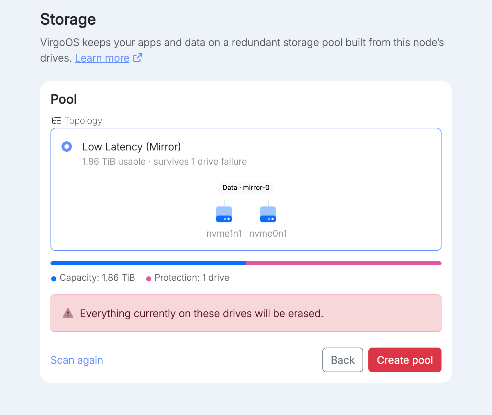
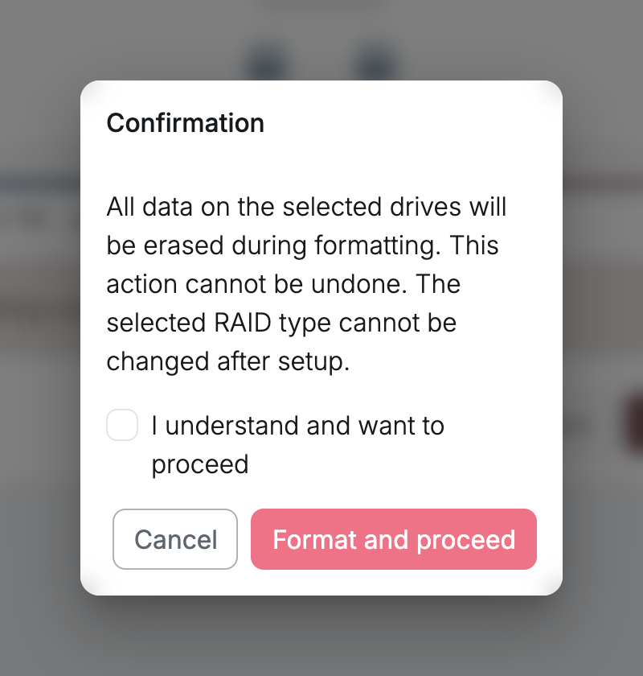
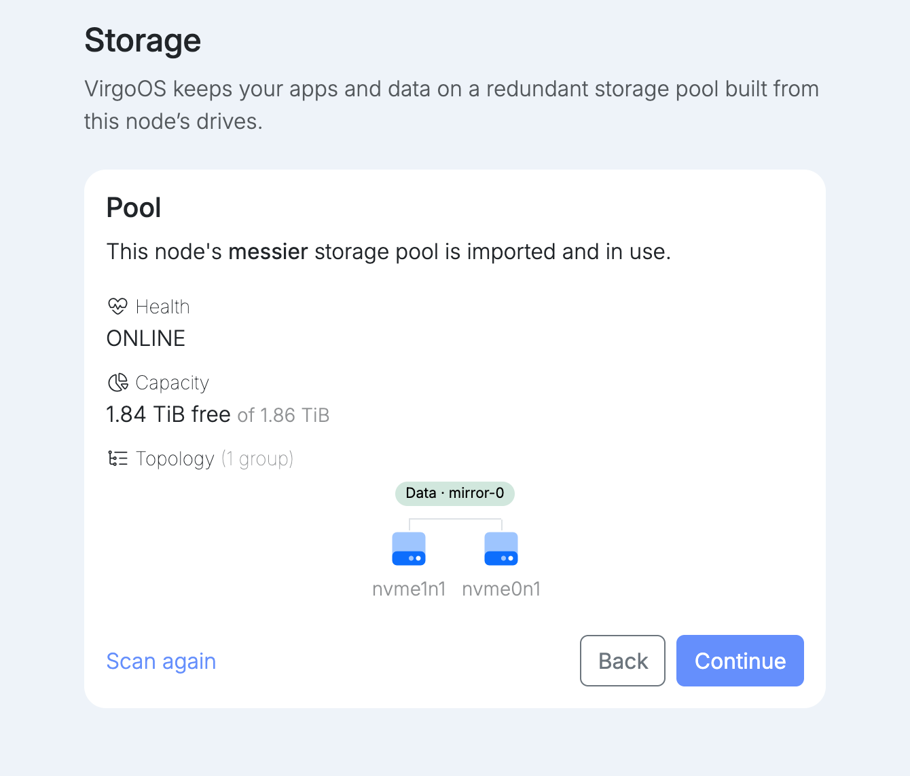

virgoOS keeps your apps and data on a redundant storage pool built from the node's drives. The drive the system runs from is never part of the pool.

The pool needs:

- **At least 2 data drives.** The drive the system runs from does not count.
- **Drives of the same size.** The smallest drive may be at most 10% smaller than the largest. Capacity is calculated from the smallest drive.

Setup offers the layouts your drives support.

| Layout | Survives |
| --- | --- |
| Low Latency (Mirror) | 1 drive failure |
| Basic Protection (RAID-Z1) | 1 drive failure |
| Advanced Protection (RAID-Z2) | 2 drive failures |
| Ultimate Protection (RAID-Z3) | 3 drive failures |

When the drives are split into several groups, each group survives that many failures. Each option shows the usable capacity and how many drives go to protection. Pick one and select **Create pool**.

Creating the pool erases everything on the drives, and the layout cannot be changed after setup. Tick **I understand and want to proceed**, then select **Format and proceed**.

If the drives already hold this node's pool, for example after reinstalling, setup offers **Import pool** instead. Importing keeps everything the pool holds. If the drives hold a pool from another system, setup warns you that creating a new pool destroys it. Use **Scan again** after attaching or removing drives.
